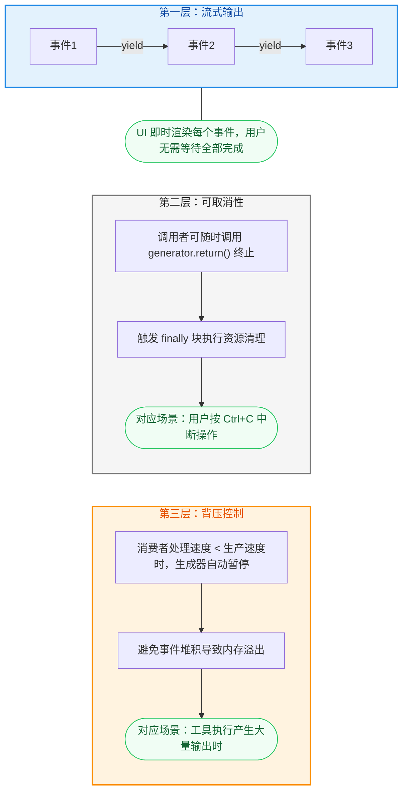

# 对话循环

Claude Code的对话主循环是一个异步生成器，他类似一个可以随时暂停或者恢复的“协程”，在对话循环和UI渲染之间建立了一条实时的事件管道

```mermaid
flowchart TD
    %% 全局样式定义
    classDef layer1Style fill:#e3f2fd,stroke:#1e88e5,stroke-width:2px,color:#0d47a1
    classDef layer2Style fill:#f5f5f5,stroke:#757575,stroke-width:2px,color:#212121
    classDef layer3Style fill:#fff3e0,stroke:#fb8c00,stroke-width:2px,color:#e65100
    classDef noteStyle fill:#f0fdf4,stroke:#22c55e,stroke-width:1px,color:#166534

    %% 第一层
    subgraph layer1["第一层：流式输出"]
        direction LR
        e1["事件1"] -->|"yield"| e2["事件2"] -->|"yield"| e3["事件3"]
    end
    note1(["UI 即时渲染每个事件，用户无需等待全部完成"])

    %% 第二层
    subgraph layer2["第二层：可取消性"]
        direction TB
        cancel["调用者可随时调用 generator.return() 终止"] --> clean["触发 finally 块执行资源清理"]
        clean --> scene2(["对应场景：用户按 Ctrl+C 中断操作"])
    end

    %% 第三层
    subgraph layer3["第三层：背压控制"]
        direction TB
        bp["消费者处理速度 < 生产速度时，生成器自动暂停"] --> mem["避免事件堆积导致内存溢出"]
        mem --> scene3(["对应场景：工具执行产生大量输出时"])
    end

    %% 结构连接
    layer1 --- note1
    note1 ~~~ layer2
    layer2 ~~~ layer3

    %% 应用样式
    class layer1 layer1Style
    class layer2 layer2Style
    class layer3 layer3Style
    class note1,scene2,scene3 noteStyle
```

