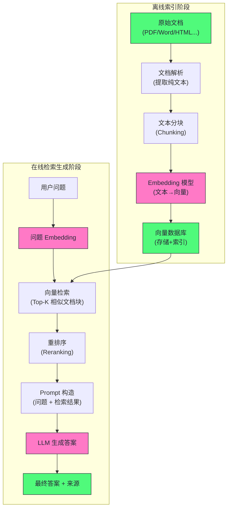

# RAG工程

## 为什么需要RAG

RAG的诞生是为了解决Agent的两个根本性的局限性——幻觉（编造内容）和知识截至日期（大模型只知道训练集中的内容）

当然，我们也可以使用微调来解决这两个问题，即在私有数据上对模型进行SFT，但实践证明，微调并不适合知识注入，原因深刻：

- 微调会遗忘：在新数据上微调会损害模型在就数据上的性能，且让AI记住10万页文档的内容需要大量的微调，代价极高
- 知识更新昂贵：每次微调都需要许多的人力和计算成本
- 微调不能精确的控制信息来源：新旧知识混合，无法保证大模型一定会用新的知识进行回答
- 知识密度问题：模型参数的信息存储效率远低于文本本身。一个 70B 模型（140 GB）能存储的”专有知识”远不如直接在推理时给模型看原始文档来得多和准确。

综上所述，预期让模型通过微调记住知识，不如在需要的时候讲相关的知识找出来塞进Prompt

## RAG整体流程

一个RAG应该分为两个阶段：离线索引阶段（准备知识库）和在线检索生成阶段（相应查询）

