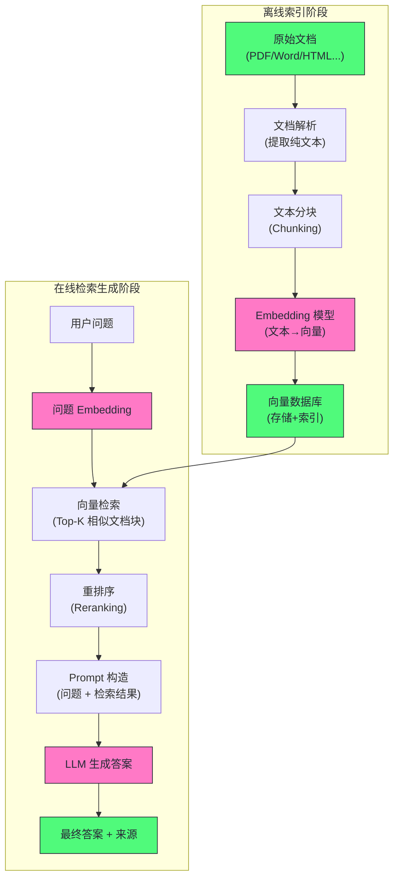

# RAG工程

## 为什么需要RAG

RAG的诞生是为了解决Agent的两个根本性的局限性——幻觉（编造内容）和知识截至日期（大模型只知道训练集中的内容）

当然，我们也可以使用微调来解决这两个问题，即在私有数据上对模型进行SFT，但实践证明，微调并不适合知识注入，原因深刻：

- 微调会遗忘：在新数据上微调会损害模型在就数据上的性能，且让AI记住10万页文档的内容需要大量的微调，代价极高
- 知识更新昂贵：每次微调都需要许多的人力和计算成本
- 微调不能精确的控制信息来源：新旧知识混合，无法保证大模型一定会用新的知识进行回答
- 知识密度问题：模型参数的信息存储效率远低于文本本身。一个 70B 模型（140 GB）能存储的”专有知识”远不如直接在推理时给模型看原始文档来得多和准确。

综上所述，预期让模型通过微调记住知识，不如在需要的时候讲相关的知识找出来塞进Prompt

## RAG整体流程

一个RAG应该分为两个阶段：离线索引阶段（准备知识库）和在线检索生成阶段（相应查询）

## 文档解析

我们的原始文件：PDF，Word，HTML等，要先被解析后才可以存到我们的知识库中，这里的解析方式有很多，OCR，直接输入或者大模型解析等等

|     文档类型     | 解析难度 |            主要工具            |     常见问题      |
| :----------: | :--: | :------------------------: | :-----------: |
| Markdown/纯文本 |  低   |            直接读取            |      几乎无      |
|     HTML     | 低-中  | BeautifulSoup, trafilatura | 噪音（导航栏/广告/脚本） |
| Word (.docx) |  中   |    python-docx, mammoth    |   样式丢失，嵌入图片   |
|   PDF（可搜索）   | 中-高  |  PyMuPDF, pdfminer, pypdf  |   多栏、表格、公式    |
|   PDF（扫描件）   |  高   | OCR: Tesseract, PaddleOCR  |   识别精度、布局分析   |
|  PowerPoint  |  中   |        python-pptx         |   文本框顺序，图表    |
|  Excel/CSV   |  中   |           pandas           |    表格结构化处理    |

## 结构化和非结构化处理

对于表格这种高度结构化的数据——每一行/列都依赖于表头，如果直接讲表格序列化为线性的文本，模型是难以理解的

更好的做法是将其转换为Markdown的形式，亦或者为每一行生成自然语言描述

而对于图表，由于纯文本Embedding模型无法处理图像，因此解决方案有两种：

- **多模态 Embedding**：用多模态 Embedding 模型（如 CLIP）将图像编码为向量，存储在向量库中
- **图像描述生成**：用多模态 LLM（如 GPT-4V）自动生成图像的文字描述，再作为文本索引

## 文本分块——Chunking策略

Embedding精度问题：Embedding模型将一段文本压缩为一个固定维度的向量，由于向量的维度是固定的，因此文本越长，具体细节越无法被精确的表达，短小精悍的Embedding质量远高于长的Embedding

另一方方面，如果文本过长，我们在进行一次检索的时候，会返回过长的模型给Agent，这回快速的填满模型的上下文，造成回复效果变差

