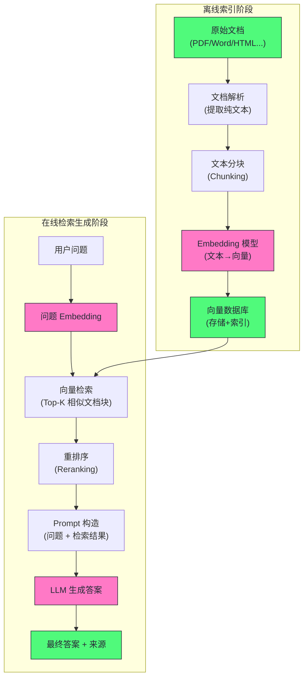

# RAG工程

## 为什么需要RAG

RAG的诞生是为了解决Agent的两个根本性的局限性——幻觉（编造内容）和知识截至日期（大模型只知道训练集中的内容）

当然，我们也可以使用微调来解决这两个问题，即在私有数据上对模型进行SFT，但实践证明，微调并不适合知识注入，原因深刻：

- 微调会遗忘：在新数据上微调会损害模型在就数据上的性能，且让AI记住10万页文档的内容需要大量的微调，代价极高
- 知识更新昂贵：每次微调都需要许多的人力和计算成本
- 微调不能精确的控制信息来源：新旧知识混合，无法保证大模型一定会用新的知识进行回答
- 知识密度问题：模型参数的信息存储效率远低于文本本身。一个 70B 模型（140 GB）能存储的”专有知识”远不如直接在推理时给模型看原始文档来得多和准确。

综上所述，预期让模型通过微调记住知识，不如在需要的时候讲相关的知识找出来塞进Prompt

## RAG整体流程

一个RAG应该分为两个阶段：离线索引阶段（准备知识库）和在线检索生成阶段（相应查询）



## 文档解析

我们的原始文件：PDF，Word，HTML等，要先被解析后才可以存到我们的知识库中，这里的解析方式有很多，OCR，直接输入或者大模型解析等等

|     文档类型     | 解析难度 |            主要工具            |     常见问题      |
| :----------: | :--: | :------------------------: | :-----------: |
| Markdown/纯文本 |  低   |            直接读取            |      几乎无      |
|     HTML     | 低-中  | BeautifulSoup, trafilatura | 噪音（导航栏/广告/脚本） |
| Word (.docx) |  中   |    python-docx, mammoth    |   样式丢失，嵌入图片   |
|   PDF（可搜索）   | 中-高  |  PyMuPDF, pdfminer, pypdf  |   多栏、表格、公式    |
|   PDF（扫描件）   |  高   | OCR: Tesseract, PaddleOCR  |   识别精度、布局分析   |
|  PowerPoint  |  中   |        python-pptx         |   文本框顺序，图表    |
|  Excel/CSV   |  中   |           pandas           |    表格结构化处理    |

## 结构化和非结构化处理

对于表格这种高度结构化的数据——每一行/列都依赖于表头，如果直接讲表格序列化为线性的文本，模型是难以理解的

更好的做法是将其转换为Markdown的形式，亦或者为每一行生成自然语言描述

而对于图表，由于纯文本Embedding模型无法处理图像，因此解决方案有两种：

- **多模态 Embedding**：用多模态 Embedding 模型（如 CLIP）将图像编码为向量，存储在向量库中
- **图像描述生成**：用多模态 LLM（如 GPT-4V）自动生成图像的文字描述，再作为文本索引

## 文本分块——Chunking策略

Embedding精度问题：Embedding模型将一段文本压缩为一个固定维度的向量，由于向量的维度是固定的，因此文本越长，具体细节越无法被精确的表达，短小精悍的Embedding质量远高于长的Embedding

另一方方面，如果文本过长，我们在进行一次检索的时候，会返回过长的模型给Agent，这回快速的填满模型的上下文，造成回复效果变差

## 分块的方式

一般常见的分块方式分为两种：固定大小分块和语义分块

- 固定大小分块：根据固定的Token数进行分块，相邻块之间有一定的重叠，保证每个块不会因为固定大小切分而被切断一个完整的语句，或是段落的开头和结尾在不同的块中
- 语义分块：按段落、按章节、按标题层级
	
	- **按段落分块**：以空行或 `\n\n` 为边界，每个段落为一个块。适合有清晰段落结构的文档。问题是段落长度差异巨大——有的段落 10 个词，有的 500 个词。
	- **递归字符分块**（LangChain 的 `RecursiveCharacterTextSplitter`）：按优先级顺序尝试不同的分隔符（`\n\n` → `\n` → `.` → ），先按段落分，段落太长则按句子分，句子太长则按空格分。这是最实用的分块策略，兼顾了语义完整性和块大小的可控性。
	- **基于 Markdown/HTML 结构分块**：如果文档有明确的标题结构（`# ## ###`），按标题层级切分，每个标题下的内容为一个块，同时在块的 metadata 中记录标题路径（如”第2章 > 2.3节 > 安装配置”）。


块的大小一般没有统一的最优解，需要根据文档类型和检索模式来调整

|          场景          |     推荐块大小      |       理由        |
| :------------------: | :------------: | :-------------: |
| 精确问答（如”XX 产品的价格是多少”） | 128-256 token  | 短块语义更精确，检索相关性高  |
|       摘要/综述类问答       | 512-1024 token |  需要更多上下文来理解主题   |
|         代码文档         |   函数级（整个函数）    | 代码语义单元是函数，不应硬切断 |
|       法律/合同文档        |   条款级（一个条款）    |    法律条款是语义单元    |

特别注意的是，块大小是RAG中最容易被忽略的超参数，对于不同的文档，我们实际上应该使用不同的分块大小，然后多次检索，以获得最好的效果

## 从小到大检索

一种更好的方式是从小到大检索：

- 小块用于检索（如128Token）——小块的Embedding精度高，检索更加准确
- 大块用于生成（如512Token）——大块的Embedding包含更多的信息，适合给LLM生成回复

我们通过小块获取其所属的父块，这样既保证了精度，又给了LLM足够的上下文，LlamaIndex 的 `NodeWithScore` 机制支持这种父子块结构

## Embedding模型

Embedding模型是将文本转换成一个固定维度的浮点数向量，语义相似的文本，其Embedding向量在高纬度空间中距离也近

还有一种是非对称Embedding，这里的非对称是指针对查询和文档进行划分，对于查询和文档进行不同的Embedding模式

- **E5 系列**：在输入前加 `query:` 或 `passage:` 前缀，用不同的前缀引导模型产生适合查询或文档的向量表示
- **BGE 系列**：类似机制，加 `为这个句子生成表示以用于检索相关文章：` 等指令

在实际使用中，如果使用非对称Embedding，那么一定要加上指令，否则可能会让查询效果下降

## 向量数据库

针对向量这种特殊的数据形式，我们需要一种新的数据库格式拉进行春初，这就是向量数据库

在实际的生产环境中，一个企业级知识库可能包含上百万个文档块，每个块都对应一个1536维的浮点向量，当用户查询到来时，需要在毫秒级找到与之最相关的Top-K个向量———这一过程利用了**近似最近邻搜索**（ANN）算法

## 常见的近似最近邻搜索算法

### HNSW(**Hierarchical Navigable Small World**)

HNSW是当前最流行的ANN算法，被Chroma，Milvus，Qdrant，Weaviate，Pgvector等几乎所有的向量库使用

HNSW的核心设计借鉴了**六度分隔理论**和**跳表**，采用的是多层图结构和贪心搜索的机制

### IVF索引

**IVF（Inverted File Index）** 是另一种常用索引，适合数据量极大（亿级+）的场景。

IVF的内存占用比HNSW低（不存储全图），但召回率通常略低于HNSW，适合显存/内存受限的场景

## 主流向量数据库对比

|     数据库      |     部署方式      |       索引类型       |         特色          | 适用规模 |
| :----------: | :-----------: | :--------------: | :-----------------: | :--: |
|  **Chroma**  |     本地/云      |       HNSW       |  轻量，Python 原生，快速原型  | 小-中  |
|  **Qdrant**  |     本地/云      |       HNSW       |  Rust 实现，高性能，过滤功能强  | 中-大  |
|  **Milvus**  |     本地/云      | HNSW/IVF/DiskANN |    企业级，高可用，多索引支持    | 大型企业 |
| **Weaviate** |     本地/云      |       HNSW       | 内置混合搜索，GraphQL API  | 中-大  |
| **pgvector** | PostgreSQL 扩展 |     HNSW/IVF     | 与 PostgreSQL 生态无缝集成 | 小-中  |
| **Pinecone** |     纯云服务      |        私有        |       全托管，零运维       |  任意  |
|  **Faiss**   |    库（非数据库）    |   HNSW/IVF/PQ    | Facebook 出品，底层研究标准  | 本地实验 |

对于初创团队或快速原型：**Chroma** 或 **pgvector**（如果已有 PostgreSQL）是最简单的选择。

对于生产级企业应用：**Qdrant** 或 **Milvus** 提供了更好的性能、可用性和管理能力。

## 检索策略

单独使用向量近似匹配实际上会有搜索不准确的问题，比如我们收缩Iphone15的电池容量，可能会搜索出Iphone14的电池容量，对于这种问题我们必须尝试解决

常见的解决方式是混合搜索，其具体步骤是：

1. 对查询分别执行向量搜索（返回 Top-K1 个结果）和 BM25搜索（返回 Top-K2 个结果）
2. 用 **RRF（Reciprocal Rank Fusion）** 等融合算法合并两个排序列表

另一种方式是使用元数据过滤，只针对限定范围的元数据进行搜索


## Reranker

由于Embedding的有损压缩的性质，因此向量搜索必然是一个粗排的过程，我们无法保证真正想要的信息在上方，而我们的大模型又更加熟悉上访的数据，在这个情况下，我们就需要重排序

重排序本身是利用专门的重排序模型进行的，主流 Reranker 模型：**bge-reranker-v2-m3**（BAAI，多语言）、**ms-marco-MiniLM-L-12-v2**（微软，英文）、**Cohere Rerank API**（付费云服务）。


## 生成阶段

将检索道德文档块（重排序后）和用户的问题组成Prompt：

```text
[System]
你是一个专业的知识库助手。根据以下提供的参考文档回答用户的问题。
- 只根据参考文档中的信息作答，不要使用你自己的背景知识
- 如果参考文档中没有足够的信息回答问题，请明确说明"文档中没有相关信息"
- 在答案末尾注明信息来源（文档名称和章节）
[参考文档]
文档1（来源：产品手册第3章）:
{chunk_1}
文档2（来源：FAQ-2024.pdf 第15页）:
{chunk_2}
文档3（来源：内部Wiki-发布流程）:
{chunk_3}
[用户问题]
{user_question}
[回答]
```

RAG在生成策略的时候也会分为严格RAG和知识增强RAG

- 严格RAG：模型只使用RAG检索出的内容进行回答，适合专业化要求高的场景（法律，医疗，金融）
- 知识增强RAG：允许模型在检索结果的基础上调用自身知识进行推理补充。适合对全面性要求更高的场景