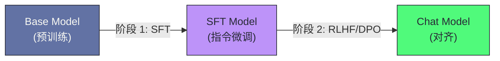

# 大模型原理

[汀哥的LLM笔记](https://ting.is-a.dev/LLM/LLM%E5%8E%9F%E7%90%86/01-%E4%BB%8E-RNN-%E5%88%B0-Transformer%E2%80%94%E2%80%94%E6%B3%A8%E6%84%8F%E5%8A%9B%E6%9C%BA%E5%88%B6%E7%9A%84%E9%9D%A9%E5%91%BD)

## RNN到Transformer

### 序列建模

人类的语言是一种天然的序列，我们可以将一句话理解为“词”按照一定的顺序进行排列的结果，而序列建模的核心就是**给定一个序列的前文，预测下一个元素**（语言模型）或者**将一个序列映射为另一个序列**（机器翻译/摘要生成）。

那么从数学的角度讲，序列建模的核心就是要解决这样一个问题：

$$P(x_t \mid x_1, x_2, \dots, x_{t-1})$$

即在知道 $t-1$ 个 token 的情况下，预测第 $t$ 个 token 的概率分布。

这个看似容易的问题在计算时要面临一个根本性的挑战：**条件概率的条件随着 $t$ 的增长而增长**。当 $t$ 过大时，模型需要记住前面的所有概率，这就是建模的核心问题——**长距离依赖**。

### 长距离依赖的问题

长距离依赖的难点在于信息传递的**衰减**和**干扰**：

- **衰减**：如果信息必须通过多个中间步骤逐步传递（如 RNN 的隐状态），每一步都会引入信息损失，传递距离越远，原始信息保留得越少。
- **干扰**：中间步骤引入的新信息会“覆盖”或“稀释”早期信息，因为隐状态的容量有限（固定维度的向量），无法无限制地累积信息。

这两个问题的根源是相同的，即**信息传递路径的长度和序列距离成正比**。如果我们的模型能够直接建立任意两个位置的连接而不需要中间位置的接力，那么长距离依赖问题就能从根源上解决——这正是 **Attention（注意力机制）** 的核心思想。

### 技术的演变

序列建模技术的演变本质上是在围绕如何缩短信息传递路径这一问题展开的。

| 模型 | 任意两位置的信息路径长度 | 并行度 | 核心限制 |
| :--- | :--- | :--- | :--- |
| **RNN** | $O(n)$ —— 必须逐步传递 | 无法并行（串行依赖） | 梯度消失/爆炸，长距离信息丢失 |
| **LSTM/GRU** | $O(n)$ —— 门控缓解但未消除 | 无法并行 | 长距离依赖仍衰减，训练慢 |
| **Attention (Seq2Seq)** | $O(1)$ —— 直接连接 | 编码端可并行，解码端串行 | 仍依赖 RNN 作为骨架 |
| **Transformer** | $O(1)$ —— Self-Attention | 完全并行 | 计算复杂度 $O(n^2)$ |


### RNN的基本结构

循环神经网络（Recurrent Neural Network，RNN）是最早为序列建模设计的神经网络架构，它的核心思想极为朴素：**用一个“隐状态”向量 $h_t$ 来累计截至目前的所有历史信息**。

在每个时间步 $t$，RNN 接收当前输入 $x_t$ 和上一步的隐状态 $h_{t-1}$，计算新的隐状态 $h_t$：

$$h_t = \tanh(W_{hh} \cdot h_{t-1} + W_{xh} \cdot x_t + b)$$

其中：

- $W_{hh}$ 是隐状态到隐状态的权重矩阵。
- $W_{xh}$ 是输入到隐状态的权重矩阵。
- $\tanh$ 是激活函数。

$h_t$ 既作为当前步的输出（可以接一个全连接层做分类/生成），也作为“记忆”传递给下一步。
```mermaid
graph LR
    X1[x1] --> H1[h1]
    X2[x2] --> H2[h2]
    X3[x3] --> H3[h3]
    XT[xT] --> HT[hT]
    H1 --> H2
    H2 --> H3
    H3 -.-> HT
    classDef input fill:#50fa7b,stroke:#282a36,color:#282a36
    classDef hidden fill:#bd93f9,stroke:#282a36,color:#282a36
    class X1,X2,X3,XT input
    class H1,H2,H3,HT hidden
````

这里面的这个 `$h_t$` 就像一个“压缩的记忆”一样，包含了 $x_1$ 到 $x_t$ 中的所有内容。

### RNN的缺陷

理论上 RNN 可以捕捉任何长度的依赖关系，但在实际训练中 RNN 又面临一个根本性的数学难题——**梯度消失和梯度爆炸**。

通俗地理解，由于权重矩阵 $W$ 的连乘效应，当 $W$ 较小时，长距离的信息在传递过程中会迅速趋于零，导致模型“忘记”远期输入。而 $W$ 过大时，又会导致信息在传递的过程中变的过分的大，让模型参数直接乱套

这个问题是由RNN架构的设计导致的，即**信息必须通过 O(n) 步的串行传递**，每一步都是一个有损的压缩，长距离信息必然衰减。这个问题不是调参数或换优化器能解决的——需要架构层面的革新

另外，RNN还有一个致命的问题，即无法并行化，因为每一个$x_t$都需要前一个$x_{t-1}$，因此这个过程在设计上就是串行的，而在如今这个大模型横行的时代，这个效率问题是致命的，后来的Transformer架构能用数万亿token训练的前提之一，就是它的Self-Attention（自注意力）机制允许序列中所有位置**同时并行计算**。

## Transformer架构————注意力机制的诞生

### Seq2Seq

注意力机制最早出现于Seq2Seq（机器翻译）模型中，解决的是一个非常具体的问题：**编码器-解码器架构中的信息瓶颈**。

编码器和解码器中间会传递一个**上下文向量c**，这个上下文向量c包含着Seq的所有信息，这样就有效的解决了编码器和解码器信息传递的问题（使用c传递）

但是上下文向量C的引入也带来了另一个问题，即当Seq过于长的时候，c无法包含所有的信息，那么就会导致传递的信息失真

### Bahdanau Attention

Bahdanau Attention改变了原本的机制，现在我们不用传递上下文向量c，而是编码器会动态的去解码器传递信息$h_j$，解码器会记住这些$h_j$，当解码器需要解码时，他会做以下三件事

- **计算分数：** 看看自己的知识中哪个词跟现在要写的词最相关？（比如翻译“Bank”时，他会重点看原文里的“银行”或者“河岸”）。
- **分配注意力（Softmax 归一化）：** 给相关的词打高分，不相关的词打低分。
- **提取重点（加权求和）：** 把这些有重点的信息综合起来，形成一个**动态的参考资料**，然后写下翻译。

### Attention机制为什么有效

注意力机制之所以能解决长距离依赖问题，根本原因在于：**它在解码器和编码器的任意位置之间建立了直接连接**。

在没有Attention的情况下，我们必须使用一个中间量c来进行传递，而c存在一个失真的问题

而有了Attention的情况下，我们先一步建立了解码器发送的每一个词和编码器中的知识的加权分值，这个表中即包含了原本序列中的信息，又包含了我们当前知识库中相关内容的信息以及分值，在进行翻译的时候，只要参考这个加权分值表即可

### Transformer————Attention is all you need

2017年，Google的Vaswani等人发表了论文《Attention is All You Need》，这篇论文开创式的提出了一个大胆的想法：**我们不需要RNN，只要Attention就够了**

这篇论文提出的Transformer架构成为了后来所有的大预言模型的基础架构，后续的GPT架构（Decoder——Only），BERT（Encoder——only），T5（Encoder——Decoder）都是Transformer架构变体

### Self——Attention：序列内部的注意力

Transformer的核心机制是他的————“Self——Attention”（自注意力机制），他不再关注编码器和解码器之间的注意力，而是转向关注**序列内部的注意力**

这里我们可以简单的来写两个不太恰当的案例来区分Self—Attention和Bahdanau中的Attention的区别

以“他从**银行**出来，走到了**河岸**边。”这一句话为例

Bahdanau Attention：

当解码器（Decoder）准备翻译出下一个词（假设目标是翻译原文中的“银行”）时：

- **解码器的“念头” ($s_{t-1}$)：** “我已经写完了‘他从...’，现在我该写那个‘地点’了，我需要看看原文里对应的那个词长什么样。”
- **编码器的“笔记” ($h_j$)：**
    - **第3页 ($h_3$)：** 记录了“银行”这个词。虽然 RNN 在读它时有点糊涂（分不清金融还是水边），但它保留了“银行”的核心特征。
    - **第7页 ($h_7$)：** 记录了“河岸”这个词。它带有强烈的“自然、地理”特征。

**然后，解码器开启“对齐（Alignment）”过程：**

1. **进行“匹配运算”：**    
    解码器拿着它的**念头 ($s_{t-1}$)**，挨个去跟编码器的**笔记 ($h_j$)** 做对比。
    - **对比 $h_3$（银行）：** 翻译官发现这个笔记上的内容跟我现在想写的“地点”高度吻合。
    - **对比 $h_7$（河岸）：** 翻译官发现这个笔记虽然不是我直接要翻译的对象，但它提供的“水边”信息对我判断 $h_3$ 极有帮助。
2. **计算“对齐分数” ($e_{t,j}$)：**
    模型内部的小型神经网络（对齐函数）给它们打分：
    - **给“银行”：** 打高分（0.6），因为它最像我要翻译的目标。
    - **给“河岸”：** 也打了一个不低的分（0.3），因为它提供了关键的语境。
3. **生成“注意力权重” ($\alpha_{t,j}$)：**
    经过归一化，形成最终的**分值表**。这张表告诉解码器：在这一步，你的精力应该 60% 放在“银行”，30% 放在“河岸”。

**结果：合成当前步的上下文向量 ($c_t$)**
- **加权融合：** 解码器并没有二选一，而是像调色一样，把 60% 的 $h_3$ 能量和 30% 的 $h_7$ 能量融合在一起。
- **最终输出：** 解码器拿到了这个“混合了环境信息的地点特征”，瞬间明白这里不能翻译成“金融机构”，于是精准地在译文中写下了代表“堤岸”的词。

Self-Attention：

在编码器（Encoder）处理原文时，每一个词都在同时进行“身份广播”**和**“环境检索”：

- **“银行”的 Query (Q)：** “我现在的语义有点模糊。谁能告诉我，我身处什么环境？”
- **“银行”的 Key (K)：** “我提供一个‘地点’的定位标签，我可能跟‘钱’有关，也可能跟‘水’有关。”
- **“河岸”的 Key (K)：** “我提供一个‘地理自然’的定位标签。”
- **“河岸”的 Value (V)：** “这是我携带的‘自然、流水、植被’的原始特征包。”

**然后，“银行”启动自身的“雷达扫描”：**
1. **进行“匹配运算”：** “银行”拿着自己的 **Query**，去碰撞序列中所有词（包括它自己）的 **Key**
    - **碰撞“他”的 K：** 匹配度低（他无法定义我的环境）。
    - **碰撞“银行”（也就是它自身）的 K：** 匹配度高（我要保留我作为一个地点的基本属性）。
    - **碰撞“河岸”的 K：** **高能关联！** “银行”的 Query 发现“河岸”的 Key 完美回应了它对环境的需求。
2. **生成“注意力分值表”：**
    这一行分值决定了“银行”接下来要吸收谁的能量：
    - **给“银行”：** 0.5 分（保持自我）。
    - **给“河岸”：** 0.4 分（极度关注）。
    - **给其他词：** 0.1 分（微弱关注）。
3. **进行“特征提取” (Value 融合)：** “银行”根据这张分值表，去抓取对应的 **Value**：
    - 抓取 **50% 自己的 Value** + 抓取 **40% “河岸”的 Value**。

**结果：产出“上下文感知的表示” (Contextual Representation)**
- **完成进化：** 在这一层结束时，输出位置上的“银行”向量已经**变样了**。它融合了大量来自“河岸”的 Value 特征。
- **语义锁定：** 此时的“银行”不再是那个左右摇摆的词，它在进入下一层之前，就已经通过这次“扫瞄”，在内部把自己标记成了“水边的那个银行”。

**这里我们可以理解成Bahdanau Attention (RNN)是在最后解码的时候才理解每个词汇是想表达什么意思，而Self-Attention (Transformer)在读完句子时，每个词的义就已经锁定了。**

## GPT架构

Transformer架构衍生出的三种主要架构是：Encoder-Only（BERT）、Decoder-Only（GPT）、Encoder-Decoder（T5）

Chat GPT中的GPT实际上就是GPT模型使用的架构的名字，全称为**Generative Pre-trained Transformer**（生成式预训练Transformer），它是一种Decoder-Only的模型

在23年之后，市面上的大预言模型使用Decoder——Only已经成为了压倒性的主流选择

### Decoder——Only

#### 训练目标的统一性与通用性

BERT的预训练目标是掩码语言模型（MLM）————随机遮住15%的token，让模型预测被遮住的部分，这是一个填空训练，模型学到的是双向的上下文表示，擅长立即但不擅长生成

GPT的预训练目标是自回归语言模型————给定前文，预测下一个token，这是最纯粹的语言建模任务，它天然包含了”理解”和”生成”两种能力：要正确预测下一个词，模型必须理解前文的语义；而预测过程本身就是生成。更重要的是，几乎所有NLP任务都可以统一为“给定输入文本，生成输出文本”的格式——翻译、摘要、问答、代码生成、数学推理，都不过是不同形式的“next token prediction”。

#### 与Scaling Law的契合

2020年，OpenAI的Kaplan等人发现了一个重要的经验规律————**Scaling Law**，在固定的计算预算下，模型性能与模型参数量、数据量和计算量之间存在幂律关系，更大的模型+更多的数据=更好的性能，这种提升是可预测的

而GPT与Scaling Law的契合是显而易见的

- 更好的数据利用效率：BERT的MLM模型只利用了15%的token作为预测目标，数据远比GPT的自回归语言模型使用每一个Token作为训练样本效率低得多
- 更稳定的架构：对于大规模的数据，架构的稳定性就显得尤为重要，GPT模型只有一个解码器栈，没有编码器-解码器之间的 Cross-Attention，超参数更少，大规模训练时更容易调优
- 涌现能力：实验表明，只有 Decoder-Only 架构在参数量超过一定阈值后才会出现显著的涌现能力，而涌现会为我们的训练带来额外的收获

#### **In-Context Learning 的天然支持**

GPT3中有一个令人震惊的发现：**In-Context Learing**，即大模型不需要微调，只需要在prompt中给一些简单的示例，模型就能学会新任务

这种能力在Encoder—only和Encoder-Decoder架构中很难自然出现，因为它们的训练目标（MLM/Span Corruption）与”根据前文示例进行推理”的范式不匹配。

而自回归语言模型天然适合In-Context Learning：prompt就是示例中的前文，模型会给予这些前文来预测后面的输出，这和预训练的目标一致

### 自回归生成的基本流程

GPT的推理是一个迭代的自回归生成循环：

1. 输入 prompt（如”中国的首都是”）
2. 模型计算所有 token 的表示，输出最后一个位置的概率分布
3. 从概率分布中采样一个 token（如”北”）
4. 将新 token 追加到输入序列，重复步骤 2-3
5. 直到生成结束符 `<eos>` 或达到最大长度

```mermaid

sequenceDiagram
    participant User as "用户输入"
    participant Model as "GPT 模型"
    participant Output as "生成输出"
    User->>Model: "中国的首都是"
    Model->>Model: "Self-Attention + FFN (所有层)"
    Model->>Output: "P(next) → 采样 '北'"
    Output->>Model: "中国的首都是北"
    Model->>Model: "Self-Attention + FFN"
    Model->>Output: "P(next) → 采样 '京'"
    Output->>Model: "中国的首都是北京"
    Model->>Output: "P(next) → 采样 '<eos>'"
```

### Tokenizer——分词器

### 什么是Tokenizer，为什么我们需要Tokenizer

我们之前说过，语言，或者说是一句话，是一个由词组成的序列，而我们的Tokenizer就是将一句完整的话，切分成一个正确，或者说是易于被我们的大模型理解的，由词组成的序列

一种最朴素的方案是按照字符或者词汇进行切分：

- **字符级**：词汇表小（几百个字符），但序列极长（一个词可能被切成 5-10 个字符），Self-Attention 的 O($n^2$) 复杂度不可接受
- **词级**：序列短，但词汇表巨大（英语几十万词），且无法处理未见过的词（OOV 问题）

实践中需要的是一个折中方案：词汇表大小适中（32K-128K），能覆盖绝大部分文本，对罕见词也能合理处理

#### BPE(Byte Pair Encoding)

BPE在2016年由Sennrich引入NLP，后来成为了GPT系列的标准分词算法，他的核心思想：**从字符级开始，反复合并出现频率最高的相邻token对，知道达到目标词汇表大小**

**训练过程**（在语料库上离线进行）：

1. 将所有文本拆分为字符（或字节），作为初始词汇表
2. 统计所有相邻 token 对的出现频率
3. 将频率最高的 token 对合并为一个新 token，加入词汇表
4. 重复步骤 2-3，直到词汇表达到预设大小（如 50257 for GPT-2）

例如，假设语料中 “th” 出现频率最高，先合并为 “th”；然后 “th” 和 “e” 的组合频率最高，合并为 “the”；如此反复。

**编码过程**（推理时对新文本使用）：按照训练得到的合并规则，贪心地对文本进行分词。常见词会被编码为一个 token（如 “the” → 一个 token），罕见词会被拆分为多个子词（如 “unconstitutional” → “un” + “constit” + “utional”）。

#### Byte-level BPE 与 SentencePiece

GPT-2则使用了**Byte-level BPE**————以字节（256 个基础 token）而非 Unicode 字符作为起点。这确保了任何 UTF-8 文本（包括中文、日文、Emoji）都能被编码，不需要预处理或特殊字符集。

LLaMA 和 Mistral 等模型使用 **SentencePiece**——一个 Google 开发的分词库，支持 BPE 和 Unigram 两种算法。SentencePiece 的特点是直接在原始文本上操作（不需要预分词），对中文等没有空格分隔的语言更友好。

| 模型          | Tokenizer               | 词汇表大小   | 特点             |
| ----------- | ----------------------- | ------- | -------------- |
| GPT-2       | Byte-level BPE          | 50,257  | 以字节为基础单元       |
| GPT-3/3.5/4 | Byte-level BPE (cl100k) | 100,256 | 更大词汇表，更好的多语言支持 |
| LLaMA       | SentencePiece (BPE)     | 32,000  | 较小词汇表，中文分词效率低  |
| LLaMA 2     | SentencePiece (BPE)     | 32,000  | 同上             |
| Qwen        | Byte-level BPE          | 151,643 | 大词汇表，中文优化      |
| DeepSeek    | Byte-level BPE          | 100,015 | 平衡中英文          |

必须要注意的一点是，Tokenizer的选择会直接影响模型的推理成本和多语言能力，词汇表中如果缺少中文常见的自/词，那么同样一段中文文本会被切成更多的 token，导致推理时间和成本成倍增加。这就是为什么 LLaMA 1（32K 词汇表，中文 token 少）处理中文时效率远低于 Qwen（151K 词汇表，大量中文 token）

#### ### 特殊 Token

除了普通文本 token，词汇表中还包含若干**特殊 token**，用于控制模型行为：

- **`<bos>`**（Beginning of Sequence）：序列开始标记
- **`<eos>`**（End of Sequence）：序列结束标记，模型生成此 token 时停止
- **`<pad>`**：填充 token，用于将不同长度的序列对齐到相同长度（batch 训练时需要）
- **`<|im_start|>` / `<|im_end|>`**：Chat 模型中用于标记对话角色（system/user/assistant）的边界

这些特殊 token 在预训练和微调中被赋予特定的语义，是模型理解输入结构的关键

### Embedding层

当Tokenizer将文本转换成一个整数ID序列之后（ID对应的是一个词，使用ID是因为我们的计算机只能处理数字），模型需要将每个ID映射为一个稠密的浮点向量——这就是**Token Embedding**的作用

对于Token Embedding，我们最需要了解的是以下两个点：

- **距离即语义**：在 Embedding 空间中，余弦相似度代表了词义的接近程度。这就是为什么能用 Embedding 模型做知识库检索。
- **不可跨模型通用**：LLaMA 的 ID `123` 对应的向量与 GPT-4 的 ID `123` 对应的向量完全不同。即便 ID 一样，维数和语义空间也是物理隔离的。

Token Embedding 被定义为一个可学习的权重矩阵 $W_E$：

$$W_E \in \mathbb{R}^{V \times d}$$

其中：

- $V$ (Vocabulary Size)：词汇表的大小。
- $d$ (Hidden Size / Embedding Dimension)：模型的维度。

其embedding(词的特征向量)就是$W_E$​的第i行

| 模型          | 词汇表大小 V | 模型维度 d | Embedding 参数量 |
| ----------- | ------- | ------ | ------------- |
| GPT-2 Small | 50,257  | 768    | ~38M          |
| GPT-2 XL    | 50,257  | 1,600  | ~80M          |
| LLaMA-7B    | 32,000  | 4,096  | ~131M         |
| LLaMA-70B   | 32,000  | 8,192  | ~262M         |

在预训练开始前，Embedding 矩阵被随机初始化。随着训练的进行，语义相似的 token 会被映射到向量空间中相近的位置——“king” 和 “queen” 的 embedding 距离会比 “king” 和 “apple” 的距离更近。

许多的模型使用了**权重共享**的设计，也就是最后的输出层和Embedding层之间共享权重，这样的好处是：

- **冷启动优势**：由于输入和输出共享权重，这类模型在微调少量数据时，对新词的感知识别往往更稳定。
- **部署优化**：对于显存极其紧张的边缘端部署，如果模型支持权重共享，你可以通过特定的量化手段进一步压减这部分参数。

### 因果注意力掩码

GPT架构仍然是Transformer架构，也就是说他训练的时候仍然采用的是Self-Attention的方式进行训练，然而这种训练方式和我们的自回归语言模型的理念是相悖的，因为我们的自回归语言模型是根据上一个词猜测下一个词，但是self-attention在训练中我们的模型可以看到一句话中的每一个部分，这样也就变成了“看着答案写作业”的训练模式，这不是我们想要的

因此我们引入了**Causal Mask**（因果掩码），它是一个下三角矩阵，将注意力分数矩阵中”未来”位置（上三角）的值设为 −∞，经过Softmax后变为0

### 采样策略

首先我们先来了解两个重要的概念，logix和softmax

- logix：模型最后的“原始得分”，在 Transformer 最后一层计算结束时，模型会给词汇表中的每一个词（Token）打分。这个**未经过归一化、正负皆有的原始分值向量**就叫 **Logits**。
- Softmax：从“得分”到“概率”的转换器，为了能按照概率选词，我们需要把这些乱七八糟的得分转化成**总和为 1 且全为正数**的概率分布。这就是 **Softmax 函数**的作用

Token表从logix经过softmax函数变成一套**总和为1且全为正数**的概率分布的表的过程就称之为归一化

#### Temperature Scaling

模型输出的logix经过softmax转换为概率分布，**Temperature**（T）参数控制分布的”尖锐程度”，它改变的是**概率分布的贫富差距**。

- **$T < 1$（缩小差距）**：强行让高分词更强，低分词更弱。模型变得**保守、听话**，适合写代码或客观事实回答。
- **$T = 1$**：保持原样，尊重模型的直觉。
- **$T > 1$（磨平差距）**：给那些低分词（平时不敢说的词）机会。模型变得**有创意、甚至胡言乱语**，适合写诗或头脑风暴。

#### Top-k 采样

结果只从概率最高的k个token中采样，其余的token概率设置为0，这避免了模型从极低概率的token中采样获得离谱的输出

Top-k的缺点在于不够灵活。有些空（比如“1+1=”）答案只有一个；有些空（比如“今天天气”）答案有几十个。固定名额要么太多，要么太少

#### Top-p 采样

**Top-p 采样**动态地选择概率之和达到 p（如 0.9）的最小 token 集合。它把词按概率从高到低排队，加起来直到够了 $p$（比如 90%）就截止。

Top-p采样是目前的主流采样方式，其优势在于**自适应**。当答案很确定时，名单可能只有 1 个人；当答案模棱两可时，名单会自动拉长。

#### Repetition Penalty（重复惩罚）

自回归模型容易陷入重复——一旦生成了某个短语，模型可能持续重复它（因为该短语的上下文”强化”了它出现的概率）。**Repetition Penalty** 对已经出现过的 token 降低其 logit 值，这样就会降低自回归模型重复前文的问题出现

### GPT架构的训练目的

GPT的训练目标极其简洁：**对于序列中的每个位置 t，最大化正确 next token 的对数概率**。简单的说，就是最大化的正确预测下一个应该出现的Token

这个过程需要极致的信息压缩，也就是说，如果想要完美的预测下一个token，模型就必须理解上下文的所有细节

- 预测 **“1+1=”** 的下一个 Token，需要模型压缩了**算术逻辑**。
- 预测 **“public class”** 后的代码，需要模型压缩了**语法规则**。
- 预测 **“《三体》的作者是”** 的下一个词，需要模型压缩了**百科知识**。 **Ilya Sutskever** 有个著名论断：**“压缩即智能”**。最大化预测概率的过程，本质上就是在有限的参数量里，压榨出对现实世界规律的最优表达。

换言之，next token prediction 是一个**压缩信息**的过程——要在有限的参数中存储尽可能多的关于世界的知识，以便准确预测任何上下文中的下一个 token

## 指令微调

经过大量数据的预训练之后我们会得到一个BaseModel，这个BaseModel中蕴含了丰富的世界知识，拥有强大的语言能力，但是其行为模式却与人类期望的AI助手存在一定的差异

将Base Model转化为我们希望的Chat Model需要在三个维度上进行调整：

- **有用性（Helpfulness）**：模型应该尽力回答用户的问题，提供有价值的信息，遵循用户的指令格式
- **无害性（Harmlessness）**：模型应该拒绝生成有害内容（暴力/歧视/非法活动指导），不输出虚假信息
- **诚实性（Honesty）**：模型应该在不确定时表达不确定，而非编造答案（减少幻觉）

对齐的过程中一般分为两个阶段：

**阶段 1：SFT（Supervised Fine-Tuning，监督微调）** 用人工标注的指令-回答对训练模型，教它理解指令格式和回答模式。

**阶段 2：RLHF / DPO** 用人类偏好数据进一步优化模型，让它学会在多个可能的回答中选择人类更偏好的那个。



### SFT————教模型理解指令

SFT的过程就是使用**高质量的数据对Base Model进行有监督微调**，我们采用大量的SFT数据，告诉AI面对一个问题应该如何去进行回答

一个SFT可能是这样的

```text
[System] 你是一个有帮助的AI助手。
[User] 请用三句话解释什么是黑洞。
[Assistant] 黑洞是时空中引力极强的区域，连光都无法逃逸。它通常由大质量恒星坍缩形成。黑洞的边界被称为事件视界，越过事件视界的任何物质和能量都无法返回。
```

训练时，模型看到完整的对话，但损失函数只对 `[Assistant]` 之后的部分进行计算。这教会模型：**当看到指令格式的输入时，应该生成回答格式的输出**。

SFT本身相对预训练是一个轻量级的过程，这是因为我们不希望大幅改变模型已学到的知识和能力，只是微调其输出行为。过高的学习率会导致”灾难性遗忘”（Catastrophic Forgetting），模型在获得指令遵循能力的同时丢失预训练中学到的知识。

SFT的效果是立竿见影的，根据LIMA论文（Meta，2023），研究人员惊讶的发现，仅用1000条精心挑选过的SFT数据就可以训练出一个质量接近GPT-4的模型（在特定的维度上）

LIMA中有一个重要的假说，即**Superficial Alignment Hypothesis**（表面对齐假说），他认为LLM的所有知识和能力都是预训练中获得的，对齐训练只是让模型知道如何以正确的模式和风格输出他已有的知识

但是SFT也有自身的局限性，SFT基于**最大似然训练**——模型被训练来模仿参考回答。这意味着：

- 模型可能学会”回答问题”的表面形式，但对”好回答”和”一般回答”之间的细微差异不敏感
- 模型无法从多个可能的回答中选择”最好的”——它只学会了模仿，没有学会”评判”
- 对于开放式任务（如创意写作），参考回答只是多种好答案中的一种，最大似然训练会限制多样性

这些局限正是 RLHF/DPO 要解决的问题。

### RLHF——用人类偏好对齐模型

RLHF 的过程是通过**人类的判断来优化模型的输出倾向**。它的核心逻辑是：**虽然教 AI 写出完美回答很难，但让人类判断哪个回答更好却很容易。**

他的核心思路是：

1. **人类很难写出最优回答，但很容易判断哪个回答更好**——标注”回答 A 比回答 B 好”远比”写出完美的回答”容易
2. 从这些偏好比较中训练一个**奖励模型**（Reward Model），学会自动评估回答质量
3. 用强化学习优化语言模型，让它生成奖励模型给高分的回答

在训练奖励模型（Reward Model）阶段中我们不给模型标准答案，而是给它出选择题。

- **操作**：针对一个问题，让模型生成多个回答（A 和 B），由人类标注哪个更好。
- **本质**：训练一个**奖励模型**，把人类的这种“感觉”量化为一个分数。
- **训练目标**：让奖励模型给人类选中的“好答案”打高分，给“差答案”打低分。

在有了打分模型后，模型进入“模拟考试”环节（PRO强化学习）：

- **生成**：模型不断尝试生成回答。
- **打分**：奖励模型实时给这些回答打分。
- **优化（PPO）**：模型根据得分调整自己的参数，目标是**最大化奖励分数**。
- **约束（KL 散度）**：为了防止模型为了拿高分而“投机取巧”（比如只会说好听的废话），需要引入一个参考模型（SFT 版本），约束模型不能跑得太偏。

### DPO—绕开强化学习的直接优化

在RLHF中，我们需要一个“中介”——**奖励模型（RM）**。模型先学RM，再根据RM的分数去优化自己。

这就造成了RLHF的几个问题：

RLHF 虽然效果好，但工程实施极其复杂：

- **四模型同时训练**：策略模型 + 参考模型 + 奖励模型 + 价值网络，显存需求约为 SFT 的 4 倍
- **训练不稳定**：PPO 算法对超参数敏感，奖励模型的质量波动会放大到策略训练中
- **Reward Hacking**：模型可能找到”骗过”奖励模型的捷径而非真正提升质量
- **采样开销大**：每个训练步都需要用当前策略做前向推理生成回答

DPO的核心则在于它通过数学推导证明了，我们不需要单独训练 RM，直接对比**好坏回答的概率差**就能达到同样的效果。

- **它的目标**：让模型在面对同一个问题时，生成“好回答”的概率越来越大，生成“坏回答”的概率越来越小。
- **公式**：$\text{Loss} = -\log(\sigma(\text{模型在好回答上的进步} - \text{模型在坏回答上的退步}))$。

DPO采用了简单的训练方式，跳过了RM模型的训练

## 推理优化

### LLM 推理的两个阶段：Prefill 与 Decode

我们要优化推理，首先得知道大模型在推理时到底在忙什么。LLM 的推理过程分为两个截然不同的阶段：

- **Prefill 阶段**：模型一次性处理整个输入 prompt。所有 token 同时参与计算，就像是在“并行阅读”。这个阶段是**计算密集型**的——GPU 的算力（TFLOPS）是瓶颈。    
- **Decode 阶段**：模型逐个 token 生成输出。每一步只产生一个词，由于自回归的特性，它必须等上一个词出来才能算下一个。这个阶段是**访存密集型**的——GPU 的显存带宽（Memory Bandwidth）是瓶颈。


|   **阶段**    | **处理方式** |    **瓶颈**    | **GPU 利用率** | **推理时间占比**  |
| :---------: | :------: | :----------: | :---------: | :---------: |
| **Prefill** |  并行处理输入  | 计算能力 (FLOPs) |      高      |   ~10-30%   |
| **Decode**  |  串行生成输出  |     显存带宽     |   **极低**    | **~70-90%** |


**结论：** Decode 阶段占据了绝大部分时间，且 GPU 算力严重闲置（都在等显存数据传输）——这就是优化的“主战场”。

### KV Cache

在自回归生成中，每产生一个新 token，模型都要和之前所有的 token 做一次 Attention。常见的做法是每生成一个新词，就把前面的词全部重新算一遍。这会导致计算量呈几何级数增长（$O(n^2)$）。    

于是我们尝试使用一种新的方法，即前面的词算过的 Key 和 Value 矩阵不会变，不妨直接把它们存进显存里，下次直接拿来用。

这就是KV Cache的设计方式

KV Cache极大地提升了速度，但它极其消耗显存，对于 LLaMA-7B 模型，每增加一个 token，KV Cache 就要占用约 **512 KB** 的显存。如果你想处理一个 32K 长度的对话，单一个人的缓存就要占掉 **16 GB**

这正是 **GQA（分组查询注意力）** 存在的意义——通过让多个 Query 共享一组 KV，把缓存体积直接砍掉数倍，否则现在的 128K 长文本根本跑不动。