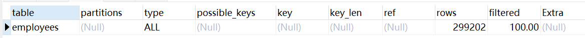

# SQL——Explain

## 前排鸣谢

[测试数据库](https://gitee.com/lzjcnb/test_db)

[explain讲解](https://www.pdai.tech/md/db/sql-mysql/sql-mysql-performance.html)

[美团技术团队](https://tech.meituan.com/2022/04/21/slow-query-optimized-advice-driven-by-cost-model.html)

## 起因

今天看到有群友提到公司业务查询速度过慢，对于这种情况立刻就想到可以使用explain关键字进行SQL分析并进行针对性优化，但是具体该怎么用呢？

## 测试数据库

https://gitee.com/lzjcnb/test_db 

**感谢开源！！！**

## 使用

```sql
explain SELECT * FROM employees 
```



* id ：select查询的序列号，包含一组数字，表示查询中执行select子句或操作表的顺序
* select_type ：操作类型 
* table ：正在访问哪个表（如果有则会使用as的名字） 
* partitions ：匹配的分区 
* **type ：访问的类型（简单查询，子查询，联合查询...）** 
* possible_keys ：显示可能应用在这张表中的索引，一个或多个，但不一定实际使用到 
* **key ：实际使用到的索引** 
* key_len ：表示索引中使用的字节数
* ref ：显示索引的哪一列被使用了
* **rows ：读取的行数** 
* filtered ：查询的表行占表的百分比 
* Extra ：其余重要信息

## 减少数据量
对于一个SQL语句，毫无疑问，查询的数据量越少查得越快
* 少使用SELECT *，只查询必要的列
* 使用Limit 来对查询内容进行分页，减少行数

## 使用索引
对于索引，只要是经常用来**搜索（where）** 和 **排序（order by）** 的数据
我们一律建议增加索引

对于索引的问题我会单独再写一篇文章

## 减少多表Join
Alibaba代码规范提到不允许使用三张表以上的连表，原因就是多表join会减慢代码速度。
面对这种情况，我们可以将一个SQL语句拆分成多个单表连接，并在应用层完成连表


