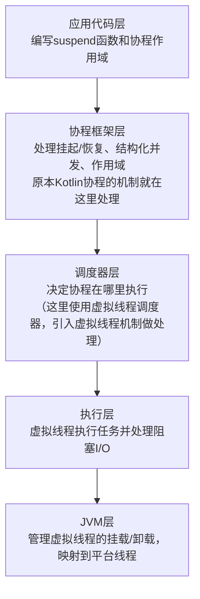

# Virtual Thread

[JEP444:关于引入虚拟线程的设想](https://openjdk.org/jeps/444)
[Kotlin协程之父对于Java虚拟线程的看法](https://www.jvm-weekly.com/p/what-does-roman-elizarov-coroutines?sd=pf)
[Java虚拟线程与Kotlin协程相互合作在SpringBoot上实践的可能](https://www.youtube.com/watch?v=szl3eWA0VRw)

Go与Kotlin的协程已经发布很长一段时间了，Java虚拟线程却在JDK21中才到来，今天我们就来聊一下协程的事情

（由于我只熟悉Java和Kotlin语言，因此本文的讨论主要是基于Java的VirtualThread和Kotlin的coroutine）

## 协程是什么？为什么是协程？

我始终认为了解一个东西必须了他为什么存在，又为为什么而来。

首先是存在了许多年的Java线程（Thread），他本质上是与操作系统的系统的线程是一一对应的，也就是一个操作系统级别的线程对应一个代码中的Thread。

这样确实解决了高并发的需求——”Thread-Per-Request“，但是对应的就会出现一个新的问题——开销太大

由于系统级别的线程产生的开销过大，因此我们很难做到创建1w个线程去应对1w个请求这种情况，因此我们迫切的需要一种轻量级的线程

也是为了解决这个需求，协程出现了

协程的协指的是协作，代表多个协程之间是相互协作的关系，多个协程基于多个或一个线程，然后大家主动的使用或者让出这个线程给其他的协程使用。

协程本身与操作系统无关，是由代码进行实现，由于与线程不再是一一对应的关系（往往协程数远大于其基于的线程数），因此开销被大范围的降低了

当然，由于协程本身还是基于操作系统的线程，因此你**不可能让一个协程的效率高于一个线程**，那么为什么我们还会说协程的效率高于线程呢？

那就要回到我们刚刚提到的让出和使用了。

在原本的线程情景下，当我们进行一些IO操作时，由于系统去进行IO请求，就导致了当前的线程会堵塞住，直到IO请求返回。

而协程情境下，当当前协程进行IO请求时，我们的协程会将自己暂时的挂起，然后将自己使用的线程释放出来，如果有其他协程正在准备使用线程，那就去拿到这个线程进行使用。

这样一来，就形成了**多个协程效率>一个线程**的情况

我知道，这时候肯定会有人说，那你都多>1了，那我多线程不行吗？当然可以，但是这里由涉及到一个问题，那就是线程的开销，协程由于由代码实现，不与操作系统线程形成强制一对一的关系，因此开销远低于线程，所以由形成了整体上 多协程>多线程的情景

## Java的VirtualThread

Java的VirtualThread最早于JDK19登场，并在JDK21进入长期维护的版本，于JDK25针对开发过程的不适进行完善（虽然可能没有完善所有问题）

由于Java自身较大的历史包袱，VirtualThread选择了从底层的Thread接口进行实现，并且实现了使用类似同步的方式来进行调用

VirtualThread最大的优势在于可以以最少的修改就能将原本的多线程代码替换为“多协程”

## Kotlin协程

Kotlin协程早于Java虚拟线程很久，因此发展相对成熟，由于涉及理念的不同，因此一般情况下Kotlin协程相对Java虚拟线程的效率更高，而且Kotlin优异的语法特点也给虚拟线程带来了很多的优势

PS：这里还有一种说法是Kotlin协程相对Java虚拟线程还适配了CPU密集型操作，这个说法其实不太准确，因为这个”适配CPU密集型操作“的过程其实和协程关系不大，而是Kotlinx库针对协程处理CPU密集型操作进行了适合的配置（模仿原本的多线程），进而导致了“适配”的结果产生，而**JRE444**提到协程的核心是**不等待**，因此就不推荐做CPU密集型操作了

**但是有两个严重的问题是Kotlin难以避免的**

### 代码染色(Code Coloring)

由于Kotlin协程使用了suspend关键字来对协程进行了标志，且协程方法只能在协程方法中进行调用，因此我们的代码自然的被分成了两块——”协程代码“和”同步代码“

这是我们不想要的，一套代码中分为两个模块略显不雅观了，同时可能还会导致在函数调用上的不便

### 对于阻塞框架的不适配

传统的阻塞框架（Spring Web/Spring Data JDBC）在于Kotlin协程相互使用时会出现不适配的问题

这是由于Kotlin协程在是否挂起/恢复时侦测的是一个方法是否”挂起友好“，这个”挂起友好“特性是Kotlin内置的一种机制，一种常见的”挂起友好“的方法就是使用suspend关键字标注的方法。

因此为了解决这个问题我们就只能使用一些挂起友好的框架（Spring Web Flux/Spring Data R2DBC）

## Java VirtualThread 与 Kotlin coroutine 协作

Kotlin和SpringBoot都主动拥抱了Java VirtualThread，这也就导致了之前Kotlin的**阻塞框架的不适配**的问题得到了解决

我们可以主动的使用虚拟线程来作为Kotlin协程的调度器

```kotlin
// 使用虚拟线程调度器
val VirtualThreadDispatcher = Executors.newVirtualThreadPerTaskExecutor().asCoroutineDispatcher()

suspend fun findById(id: Long): User? {
    return withContext(VirtualThreadDispatcher) {
        // 关键点：此协程任务被分配给一个虚拟线程执行
        jdbcTemplate.queryForObject("SELECT * FROM users WHERE id = ?", id)
        // 虚拟线程处理阻塞，而不是协程机制
    }
}
```

这样原本协程的任务就会被交到虚拟线程池种进行执行，虚拟线程池会主动的分配一个虚拟线程来给到协程进行执行任务，然后虚拟线程会使用自己的机制来解决Java原生的阻塞问题，同时由于协程状态机的存在，因此原本针对suspend的协程调用也依然使用

