# SpringAiAlibaba——工作流

## Graph与workflow

相较于SpringAI对底层的原子抽象，SpringAIAlibaba（SAA）选择了将部分重心放在了实现SAA Graph上，这一部分是SAA对langchain的langgraph的Java版实现，社区在此基础上增加了大量预置 Node、简化了 State 定义过程等，让开发者更容易编写对等低代码平台的工作流、多智能体。

**目前官方推荐使用[SAA Graph](https://java2ai.com/docs/1.0.0.2/tutorials/graph/whats-spring-ai-alibaba-graph/)来对工作流进行开发**

SAA Graph目前支持mcp，多节点并行执行，流式输出功能
## 是否支持某一节点等待用户确认再继续操作？

支持，SAA对这一方面做了专门的支持，官方称之为[人类反馈](https://java2ai.com/docs/1.0.0.2/tutorials/graph/human-in-the-loop/)

**值得注意的是，官方示例中使用到了一个仅属于SAA 1.0.0.3-SNAPSHOT的方法，但该版本还未正式发布且尚未有文档**

## 现有的版本问题

在对官方文档和示例的学习中发现示例大量使用了SAA 1.0.0.3-SNAPSHOT而非1.0.0.2，且1.0.0.3-SNAPSHOT的许多示例无法正常在1.0.0.2版本运行。

## 教程

**注意：SAA的文档仅给出了官方示例，但未对官方示例中使用到的类和方法进行详细的解释**

### 核心类

1. StateGraph（状态图/工作流图） 定义整个工作流的主类。 支持添加节点（addNode）、边（addEdge、addConditionalEdges）、条件分支、子图等。 可校验图结构，最终编译为 CompiledGraph 以供执行。
    
2. Node（节点） 表示工作流中的单个步骤（如模型调用、数据处理等）。 支持异步节点，可封装大模型调用或自定义逻辑。
    
3. Edge（边） 表示节点之间的转移关系。 支持条件分支（根据状态决定下一个节点）。
    
4. OverAllState（全局状态） 可序列化的全局状态对象，贯穿整个工作流。 支持按 key 注册不同的合并/更新策略（如替换、合并等）。 用于数据传递、断点续跑、人工干预等。**（ps：该类已在1.0.0.3-SNAPSHOT中被弃用，新版本使用KeyStrategyFactory进行替代）**
    
5. CompiledGraph（已编译图） StateGraph 的可执行版本。 负责实际的节点执行、状态流转、结果流式输出。 支持中断、并行节点、检查点等高级特性。
	
6. OverAllStateFactory（全局状态工厂） 用于在StateGraph中定义初始状态和关键策略，其创建的OverAllState类用于在整个图的流程中用来传递数据（上下文），OverAllState中的数据是以kv的形式存储的
	
7. NodeAction 所有node（节点）统一要求实现的接口，内含唯一的方法Map<String, Object> apply(OverAllState state) throws Exception用于书写当前节点需要做的事情，入参为我们在工厂中定义的上下文，返回值map返回的就是OverAllState的kv
	
8. EdgeAction 所有条件边统一要求实现的接口，内含唯一的方法String apply(OverAllState state) throws Exception用于书写当前边需要做的事情，入参为我们在工厂中定义的上下文，String用于映射后续要使用哪个节点

### 使用SAA Graph创建工作流的简单流程

1. 定义节点和条件边（如果需要）
 
2. 通过KeyStrategyFactory类定义上下文中所有要用到的kv数据
 
3. 通过StateGraph类创建边和节点，进而整体构建图
 
4. 使用 stateGraph.compile(....)将图转化（编译）为可运行的图CompiledGraph

5. 在Controller将前端传入数据转换为map并给到图的CompiledGraph的stream方法

### 使用用户中断的案例及教程

[示例Github链接](https://github.com/springaialibaba/spring-ai-alibaba-examples/tree/main/spring-ai-alibaba-graph-example/human-node)

#### **GraphConfig**

```java
@Configuration
@Slf4j
public class GraphConfig {

    @Bean
    public StateGraph humanGraph(ChatClient.Builder chatClientBuilder) throws GraphStateException {
        KeyStrategyFactory keyStrategyFactory = () -> {
            HashMap<String, KeyStrategy> keyStrategyHashMap = new HashMap<>();
            // 用户输入
            keyStrategyHashMap.put("query", new ReplaceStrategy());
            keyStrategyHashMap.put("thread_id", new ReplaceStrategy());

            keyStrategyHashMap.put("expander_number", new ReplaceStrategy());
            keyStrategyHashMap.put("expander_content", new ReplaceStrategy());

            // 人类反馈
            keyStrategyHashMap.put("feed_back", new ReplaceStrategy());
            keyStrategyHashMap.put("human_next_node", new ReplaceStrategy());

            // 是否需要翻译
            keyStrategyHashMap.put("translate_language", new ReplaceStrategy());
            keyStrategyHashMap.put("translate_content", new ReplaceStrategy());
            return keyStrategyHashMap;
        };

        StateGraph stateGraph = new StateGraph(keyStrategyFactory)
                //在图中添加节点
                .addNode("expander", node_async(new ExpanderNode(chatClientBuilder)))
                .addNode("translate", node_async(new TranslateNode(chatClientBuilder)))
                .addNode("human_feedback", node_async(new HumanFeedbackNode()))
                //在图中添加边
                .addEdge(StateGraph.START, "expander")
                .addEdge("expander", "human_feedback")
                .addConditionalEdges("human_feedback", AsyncEdgeAction.edge_async((new HumanFeedbackDispatcher())), Map.of(
                        "translate", "translate", StateGraph.END, StateGraph.END))
                .addEdge("translate", StateGraph.END);

        // 添加 PlantUML 打印，会在启动时以PlantUML的形式打印graph的流程
        GraphRepresentation representation = stateGraph.getGraph(GraphRepresentation.Type.PLANTUML,
                "human flow");
        log.info("\n=== expander UML Flow ===");
        log.info(representation.content());
        log.info("==================================\n");

        return stateGraph;
    }
}
```

**上下文中存储的内容**：
- query：用户的问题
- expandernumber：扩展的数量
- expandercontent：扩展的内容
- feedback：人类反馈的内容
- humannextnode：人类反馈后的下一个节点
- translatelanguage：翻译的目标语言，默认为英文
- translatecontent：翻译的内容

**注意点**：
1. StateGraph.START\/StateGraph.END：官方设定的Graph的起点与终点

2. keyStrategyFactory：用来创建上下文，内部是kv的结构，对应上下文中的多组kv关系

3. new ReplaceStrategy()：每次写入会覆盖调原本的旧值

4. node_async()：将每个 NodeAction 包装为异步节点执行（提高吞吐或防止阻塞，具体实现框架已封装）

5. addEdge()：添加一条边，两个参数是前一个节点的名和后续节点名

6. addNode()：添加一个节点，两个参数是节点名和节点类

7. addConditionalEdges()：用来添加一个条件边，这里传入的三个参数分别为前一个节点的名字，条件边的类，边接下来走向的map（k：边返回的String，v：节点对应的String，进而形成接下来走向的映射）

#### **HumanFeedbackDispatcher**

```java
public class HumanFeedbackDispatcher implements EdgeAction {
    @Override
    public String apply(OverAllState state) throws Exception {
        return (String) state.value("human_next_node", StateGraph.END);
    }
}
```

**注意点：**
1. EdgeAction：所有的条件边必须实现该接口

2. public String apply(OverAllState state) throws Exception：EdegAction中唯一的方法，返回值为上述addConditionalEdges中第三个参数的map中的k，用来与节点名对应，入参OverAllState为上下文

3. state.value()：从state中取出第一个参数对应的值，若为null则返回第二个参数

#### **ExpanderNode**

```java
@Slf4j
public class ExpanderNode implements NodeAction {

    private static final PromptTemplate DEFAULT_PROMPT_TEMPLATE = new PromptTemplate("You are an expert at information retrieval and search optimization.\nYour task is to generate {number} different versions of the given query.\n\nEach variant must cover different perspectives or aspects of the topic,\nwhile maintaining the core intent of the original query. The goal is to\nexpand the search space and improve the chances of finding relevant information.\n\nDo not explain your choices or add any other text.\nProvide the query variants separated by newlines.\n\nOriginal query: {query}\n\nQuery variants:\n");

    private final ChatClient chatClient;

    private final Integer NUMBER = 3;

    public ExpanderNode(ChatClient.Builder chatClientBuilder) {
        this.chatClient = chatClientBuilder.build();
    }

    @Override
    public Map<String, Object> apply(OverAllState state) {
        log.info("expander node is running.");

        String query = state.value("query", "");
        Integer expanderNumber = state.value("expander_number", this.NUMBER);

        Flux<ChatResponse> chatResponseFlux = this.chatClient.prompt().user((user) -> user.text(DEFAULT_PROMPT_TEMPLATE.getTemplate()).param("number", expanderNumber).param("query", query)).stream().chatResponse();

        AsyncGenerator<? extends NodeOutput> generator = StreamingChatGenerator.builder()
                .startingNode("expander_llm_stream")
                .startingState(state)
                .mapResult(response -> {
                    String text = response.getResult().getOutput().getText();
                    List<String> queryVariants = Arrays.asList(text.split("\n"));
                    return Map.of("expander_content", queryVariants);
                }).build(chatResponseFlux);
        return Map.of("expander_content", generator);
    }

}

```

**注意点：**
1. NodeAction：所有的节点必须实现该接口

2. public Map<String, Object> apply(OverAllState state) ：NodeAction中唯一的方法，返回值为最初定义的工厂类中OverAllState中的kv对应的Map，入参OverAllState为上下文

3. StreamingChatGenerator：用于构建流式输出（文档中没有这一块的解释，根据测试推测大概含义）
	
	1. startingNode：流式输出中data的k
	
	2. startingState：上下文
	
	3. mapResult：用于构建流式输出结束后的返回值

#### **HumanFeedbackNode**

```java
@Slf4j
public class HumanFeedbackNode implements NodeAction {

    private static final Logger logger = LoggerFactory.getLogger(HumanFeedbackNode.class);

    @Override
    public Map<String, Object> apply(OverAllState state) {
        logger.info("human_feedback node is running.");
        HashMap<String, Object> resultMap = new HashMap<>();
        String nextStep = StateGraph.END;

        Map<String, Object> feedBackData = state.humanFeedback().data();
        boolean feedback = (boolean) feedBackData.getOrDefault("feed_back", true);
        if (feedback) {
            nextStep = "translate";
        }

        resultMap.put("human_next_node", nextStep);
        logger.info("human_feedback node -> {} node", nextStep);
        return resultMap;
    }
}
```

**注意点**

1. Map<String, Object> feedBackData = state.humanFeedback().data()：这里是前端传过来后经过controller处理的数据，具体在下面controller中进行解释

#### **TranslateNode**

```java
@Slf4j
public class TranslateNode implements NodeAction {

    private static final PromptTemplate DEFAULT_PROMPT_TEMPLATE = new PromptTemplate("Given a user query, translate it to {targetLanguage}.\nIf the query is already in {targetLanguage}, return it unchanged.\nIf you don't know the language of the query, return it unchanged.\nDo not add explanations nor any other text.\n\nOriginal query: {query}\n\nTranslated query:\n");

    private final ChatClient chatClient;

    private final String  TARGET_LANGUAGE= "English";

    public TranslateNode(ChatClient.Builder chatClientBuilder) {
        this.chatClient = chatClientBuilder.build();
    }

    @Override
    public Map<String, Object> apply(OverAllState state) {
        log.info("translate node is running.");

        String query = state.value("query", "");
        String targetLanguage = state.value("translate_language", TARGET_LANGUAGE);

        Flux<ChatResponse> chatResponseFlux = this.chatClient.prompt().user((user) -> user.text(DEFAULT_PROMPT_TEMPLATE.getTemplate()).param("targetLanguage", targetLanguage).param("query", query)).stream().chatResponse();
        AsyncGenerator<? extends NodeOutput> generator = StreamingChatGenerator.builder()
                .startingNode("translate_llm_stream")
                .startingState(state)
                .mapResult(response -> {
                    String text = response.getResult().getOutput().getText();
                    List<String> queryVariants = Arrays.asList(text.split("\n"));
                    return Map.of("translate_content", queryVariants);
                }).build(chatResponseFlux);
        return Map.of("translate_content", generator);
    }
}
```

和**ExpanderNode**类似

#### **GraphProcess**

```java
@Slf4j
public class GraphProcess {
    private final ExecutorService executor = Executors.newSingleThreadExecutor();

    private CompiledGraph compiledGraph;

    public GraphProcess(CompiledGraph compiledGraph) {
        this.compiledGraph = compiledGraph;
    }

    public void processStream(AsyncGenerator<NodeOutput> generator, Sinks.Many<ServerSentEvent<String>> sink) {
        executor.submit(() -> {
            generator.forEachAsync(output -> {
                try {
                    log.info("output = {}", output);
                    String nodeName = output.node();
                    String content;
                    if (output instanceof StreamingOutput streamingOutput) {
                        content = JSON.toJSONString(Map.of(nodeName, streamingOutput.chunk()));
                    } else {
                        JSONObject nodeOutput = new JSONObject();
                        nodeOutput.put("data", output.state().data());
                        nodeOutput.put("node", nodeName);
                        content = JSON.toJSONString(nodeOutput);
                    }
                    sink.tryEmitNext(ServerSentEvent.builder(content).build());
                } catch (Exception e) {
                    throw new CompletionException(e);
                }
            }).thenAccept(v -> {
                // 正常完成
                sink.tryEmitComplete();
            }).exceptionally(e -> {
                sink.tryEmitError(e);
                return null;
            });
        });
    }
}

```

辅助类，主要用于将结果写道Sink中

**注意点：**

1. ExecutorService executor：配置线程池，获取 stream 流

#### **GraphHumanController**

```java
@RestController
@RequestMapping("/graph/human")
public class GraphHumanController {

    private static final Logger logger = LoggerFactory.getLogger(GraphHumanController.class);

    private final CompiledGraph compiledGraph;

    @Autowired
    public GraphHumanController(@Qualifier("humanGraph") StateGraph stateGraph) throws GraphStateException {
        SaverConfig saverConfig = SaverConfig.builder().register(SaverConstant.MEMORY, new MemorySaver()).build();
        this.compiledGraph = stateGraph
                .compile(CompileConfig.builder().saverConfig(saverConfig).interruptBefore("human_feedback").build());    }

    @GetMapping(value = "/expand", produces = MediaType.TEXT_EVENT_STREAM_VALUE)
    public Flux<ServerSentEvent<String>> expand(@RequestParam(value = "query", defaultValue = "你好，很高兴认识你，能简单介绍一下自己吗？", required = false) String query,
                                                @RequestParam(value = "expander_number", defaultValue = "3", required = false) Integer expanderNumber,
                                                @RequestParam(value = "thread_id", defaultValue = "yingzi", required = false) String threadId) throws GraphRunnerException {
        RunnableConfig runnableConfig = RunnableConfig.builder().threadId(threadId).build();
        Map<String, Object> objectMap = new HashMap<>();
        objectMap.put("query", query);
        objectMap.put("expander_number", expanderNumber);

        GraphProcess graphProcess = new GraphProcess(this.compiledGraph);
        Sinks.Many<ServerSentEvent<String>> sink = Sinks.many().unicast().onBackpressureBuffer();
        AsyncGenerator<NodeOutput> resultFuture = compiledGraph.stream(objectMap, runnableConfig);
        graphProcess.processStream(resultFuture, sink);

        return sink.asFlux()
                .doOnCancel(() -> logger.info("Client disconnected from stream"))
                .doOnError(e -> logger.error("Error occurred during streaming", e));
    }

    @GetMapping(value = "/resume", produces = MediaType.TEXT_EVENT_STREAM_VALUE)
    public Flux<ServerSentEvent<String>> resume(@RequestParam(value = "thread_id", defaultValue = "yingzi", required = false) String threadId,
                                                @RequestParam(value = "feed_back", defaultValue = "true", required = false) boolean feedBack) throws GraphRunnerException {
        RunnableConfig runnableConfig = RunnableConfig.builder().threadId(threadId).build();
        StateSnapshot stateSnapshot = this.compiledGraph.getState(runnableConfig);
        OverAllState state = stateSnapshot.state();
        state.withResume();

        Map<String, Object> objectMap = new HashMap<>();
        objectMap.put("feed_back", feedBack);

        state.withHumanFeedback(new OverAllState.HumanFeedback(objectMap, ""));

        // Create a unicast sink to emit ServerSentEvents
        Sinks.Many<ServerSentEvent<String>> sink = Sinks.many().unicast().onBackpressureBuffer();
        GraphProcess graphProcess = new GraphProcess(this.compiledGraph);
        AsyncGenerator<NodeOutput> resultFuture = compiledGraph.streamFromInitialNode(state, runnableConfig);
        graphProcess.processStream(resultFuture, sink);

        return sink.asFlux()
                .doOnCancel(() -> logger.info("Client disconnected from stream"))
                .doOnError(e -> logger.error("Error occurred during streaming", e));
    }
}
```

**注意点：**

1. SaverConfig：用来配置如何保存状态

2. CompileConfig.builder().saverConfig(saverConfig).interruptBefore(“humanfeedback”）：在humanfeedback节点前断流

3. Sinks.Many\<ServerSentEvent> sink：接收 Stream 数据

4. expand方法中的expanderNumber参数：将提出的问题扩展为 n 条（上述代码中用的默认值为3）相似问题

5. resume方法中的this.compiledGraph.getState(runnableConfig)：获取上次截断的状态、

6. resume方法中的state.withResume()：表示恢复

7. resume方法中的state.withHumanFeedback(new OverAllState.HumanFeedback(objectMap, ""))：在state中放入HumanFeedback，也就是上述**HumanFeedbackNode**中的 state.humanFeedback().data();

#### 简单解释上述代码逻辑

```plantuml
@startuml human_flow
skinparam usecaseFontSize 14
skinparam usecaseStereotypeFontSize 12
skinparam hexagonFontSize 14
skinparam hexagonStereotypeFontSize 12
title "human flow"
footer

powered by spring-ai-alibaba
end footer
circle start<<input>> as __START__
circle stop as __END__
usecase "expander"<<Node>>
usecase "translate"<<Node>>
usecase "human_feedback"<<Node>>
hexagon "check state" as condition1<<Condition>>
"__START__" -down-> "expander"
"expander" -down-> "human_feedback"
"human_feedback" .down.> "condition1"
"condition1" .down.> "__END__"
'"human_feedback" .down.> "__END__"
"condition1" .down.> "translate"
'"human_feedback" .down.> "translate"
"translate" -down-> "__END__"
@enduml
```



**expand接口**

将输入的数据存到state(上线问中)并先进入expander节点，然后进入humanfeedback节点，但由于配置导致数据在进入humanfeedback节点前被截断，等待用户输入数据

**resume接口**

同过threadId查处state并将用户的数据放到state与SAA在state中内置的HumanFeedback类中，然后传输给humanfeedback节点让其继续运行