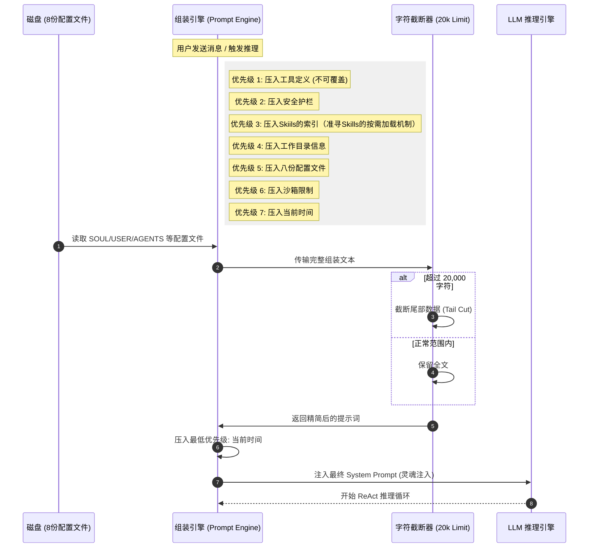
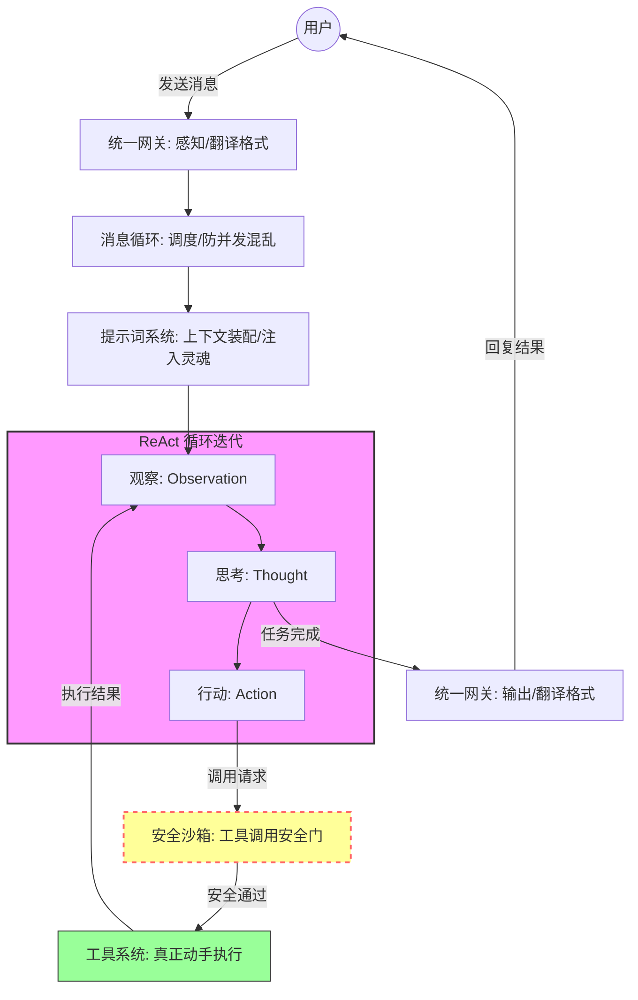

# Open Claw

[Hello-Claw](https://datawhalechina.github.io/hello-claw/)

Open claw成为了26年初最火热的项目，作为开发者肯定要第一时间来调研一下（虽然其实已经有些晚了）

## 安装

[HelloClaw的安装教程](https://datawhalechina.github.io/hello-claw/cn/adopt/chapter2/)

类似的教程还有很多，这里就不赘述了

值得一提的是，如果你使用的是Docker构建，且还是建立在WSL环境下，那么大概率会遇到部署上的问题，OpenClaw Gateway会一直重启，这是目前版本的小bug（2026-3），可以在OpenClaw的issue上找到相对应的解决方案，回答者也已经即时提交了PR，相信不久后就会得到修复

## OpenClaw究竟是什么

**OpenClaw是Agent**

这是对OpenClaw最好的诠释，即时OpenClaw核心基于Multi-Agent的思想进行开发，仍然逃脱不开Agent的定义

正如Google Agent白皮书上写的一样：

**宽泛地来说，生成式 AI Agent 可以被定义为一个应用程序， 通过观察周围世界并使用可用的工具来实现其目标**

不论是最近的OpenClaw还是当年的Manus，其本质都是Agent开发的爆火，只是Manus是一个闭源的，运行在云端上的，可定制化低的Agent，而OpenClaw这是一个开源的，可以运行在本地的，高定制化的Agent

这也进一步的说明了目前Agent开发的趋势————让Agent通过电脑来尽可能的完成人可以完成的操作

## OpenClaw的工具

**工具是将基础模型与外部世界连接起来的桥梁**

OpenClaw的强大能力就来源于各种各样的Tools，某种程度上，MCP，AgentSkills都属于广义上的Tools，但是我们一般会将编码在项目内部的Tools称之为Tools

OpenClaw的工具分为四个档次

|    配置档    |          能力范围          |        适用场景        |
| :-------: | :--------------------: | :----------------: |
|   full    |       无限制，所有工具可用       |   推荐——个人电脑上的全能助手   |
|  coding   | 文件读写、命令执行、会话管理、记忆、图片分析 |   开发者专用，不含消息和浏览器   |
| messaging |     消息收发、会话浏览、状态查看     | 纯聊天机器人，不能操作文件或执行命令 |
|  minimal  |         仅状态查看          |   最小权限，几乎什么都不能做    |

网上传的神乎其神的功能本质上就是启动了full权限，我们可以通过下列指令将其修改为full权限

```sh
# 查看当前配置
openclaw config get tools.profile

# 设置为 full（推荐）
openclaw config set tools.profile full
openclaw gateway restart
```

## OpenClaw的网关

OpenClaw的网关是OpenClaw运行的关键，如果我们使用Docker启动OpenClaw，不难发现启动的实际上就是一个OpenClaw的网关

OpenClaw的网关默认接受外界的信息（WebUI和聊天软件等），然后完成对LLM的调度

## LLM能力发展的过程

23年，OpenAI早期发布了FunctionCalling功能，为LLM提供了调用API的能力，在此之后，LLM就不仅限于为人们提供建议了，Agent也就由此而生

22年，普林斯顿大学与Google研究院一同发表了ReAct的论文，提出了推理和行动应该交织进行

- 传统方式: 先规划完所有步骤 → 按步骤执行（一次性，不能调整）
- ReAct方式: 观察 → 思考 → 行动 → 观察 → 思考 → 行动 ...（循环迭代）

此后的大模型便可以一次对话调用多个工具，进一步拓展了AI的实力


## AgentRuntime

AgentRutime是OpenClaw设计的核心之一，我们首先要理解什么是AgentRuntime

要理解AgentRuntime首先要理解Runtime是什么，Wiki中给出的解释是：“`运行时（Run time）`在计算机科学中**代表一个**计算机程序从开始执行到终止执行的运作、执行的**时期**

简单的讲，Runtime就是一个时期，这个时期包含了程序的开始到结束，具象化就表现为这个运行期所必须的所有东西（包含所有的代码和环境），这个东西将会贯穿整个程序运行的始终

所以我们不难发现，有些代码，如果想要将一个实例注册为全局任意时间可用，经常会将其给到一个叫XXXRuntime的东西，本质上也是这个含义（有些时候也会注册给一个叫XXXContext的东西，这个东西叫上下文，本身可以理解为Runtime的一部分）

回到AgentRuntime，我们不难理解，AgentRuntime就是Agent从开始到结束的运行时间，与直接与LLM对话的核心区别就在于维护了一个长期的状态，而根据Agent的定义，Agent是必须要有对外的Tool的，所以AgentRuntime自然也包含Tools，进而也就拥有了更多的能力

OpenClaw的创始人Peter Steinberger在原有基础上希望完成的是一个更加方便的Agent，可以通过简单的配置实现复杂的Agent功能

目前的OpenClaw可以实现编辑markdown就完成对于Agent的实现

## OpenClaw的核心设计

我们来看一下OpenClaw中包含的各个系统

- ReAct循环：使LLM在一次用户感知的对话中调用多个工具
- 提示词工程：给LLM赋予基础的身份
- 工具系统：各个Tools
- 消息循环：定时任务
- 统一网关：对外部的消息进行统一的接受和回应
- 安全沙箱：对系统提供一个基础的安全保护

### ReAct系统

:::info
在ReAct系统下，用户的一次对话会经过LLM的多次思考，然后调用不同的工具，即使工具发生错误了也不会报错，而是将错误信息当作反馈内容继续思考
:::

ReAct：ReasoningActing，即推理行动系统

ReAct论文本身指出，推理和行动本身不应该分开，应该先思考在行动，行动后对内容进行观察，观察后再次思考，然后再进行行动，进而进入一个循环，直到任务的完成

对于多轮的ReAct，为了尽可能的保证消息的准确性，OpenClaw选择采用显示的对话历史，也就是说这个过程更加偏向正常的多轮对话

对于较长的内容，OpenClaw采用了三层的架构

|  层级  | 时间范围 |      存储方式       |     类比     |
| :--: | :--: | :-------------: | :--------: |
| 工作记忆 | 当前会话 |    对话历史（内存）     | 桌面上摊开的工作文件 |
| 长期记忆 | 跨会话  | MEMORY.md（文件系统） | 抽屉里的工作笔记本  |
| 世界知识 | 按需获取 |     通过工具读取      | 图书馆，用时才去借  |

当上下文太长时，OponClaw则会对内容进行压缩

```text
预防性压缩（每轮完成后检测）： 
上下文压力超过阈值 → 主动压缩早期记录为摘要 → 为后续轮次腾空间 

溢出修复（已超出限制时）： 
立即压缩早期消息为摘要，保留最近N轮完整记录 → 继续执行
```


对于何时终止ReAct的过程，OpenClaw则是采用以下的三种条件：

| 终止类型 |   触发条件    |    Agent的行为    |
| :--: | :-------: | :------------: |
| 正常终止 | 模型判断任务已完成 |  生成最终回复，发给用户   |
| 安全终止 | 达到资源或时间边界 |  汇报当前进度，请求指示   |
| 异常终止 | 持续失败无法恢复  | 诚实报告卡在哪里、原因是什么 |

### 提示词工程

OpenClaw的提示词工程基于八个文件

|      文件      |        一句话说明         |
| :----------: | :------------------: |
|   SOUL.md    | 定义"我是谁"——性格、价值观、行为准则 |
|   USER.md    |   定义"你是谁"——用户画像、偏好   |
|  AGENTS.md   | 定义"我怎么做事"——决策规则、工作流程 |
|   TOOLS.md   |   定义"我有什么资源"——环境配置   |
| IDENTITY.md  |      名字、头像等基础身份      |
|  MEMORY.md   |     长期记忆——事实、经验      |
| HEARTBEAT.md |        定时任务清单        |
| BOOTSTRAP.md |      首次运行的初始化引导      |

这些文件会在每一次对话时被注入到系统提示词中，Agent始终对于当前的环境有着清楚的认知，且这些信息是热更新的，OpenClaw的md文件发生变化，无需重启OpenClaw就能立刻感受到

与传统的提示词工程不同，OpenClaw将角色和行为准则拆分为SOUL.md和AGENT.md两个文件，这样的好处就是防止了大模型根据角色猜测自身的行为准则

```
SOUL.md 回答"这个Agent是什么样的存在"，是价值观与信念，不被用户请求覆盖，是底层操作系统
"我是专注安全的系统工程师，不确定时保守行事。" 

AGENTS.md 回答"这个Agent怎么工作"，是决策流程与操作规范，可根据场景调整
"收到部署请求：检查覆盖率 → 确认环境变量 → 发确认消息 → 等待批准 → 执行部署"
```

每当用户发出消息时，Agent进行推理之前，OpenClaw都会读取所有的配置文件，然后动态装提示词，




### 工具系统

对于工具的数量，其实一直存在一个问题，工具太少，可能功能不够完善，工具太多，LLM不知道使用哪一个，那么究竟需要几个工具就成了问题，OpenClaw给出的答案是：4个

- read：读取文件
- write：创建文件
- edit：修改文件
- exec：执行命令

正是这四个工具实现了OpenClaw的基础功能，并让OpenClaw可以通过Skills实现模块化拓展的能力

#### read

read工具的核心问题是要解决文件的大小和窗口大小的问题，read采用三层机制来解决问题

```
第一层：预算感知
计算当前上下文剩余空间
文件超出预算 → 触发截断

第二层：智能截断（按文件类型差异化） 
代码文件 → 保留头部（import + 函数签名）
日志文件 → 保留尾部（最新的错误最有价值）
配置文件 → 尽量完整（配置项相互依赖）

第三层：分页支持 
明确告知还有多少内容未读
Agent 可发起第二次调用继续读取
```

这里的核心设计是告诉大模型还有多少的内容没有读，进而可以让大模型自己去选择是否要继续读入内容

#### write

write的核心是原子性，先写入临时文件，成功后再重命名为目标文件。重命名在操作系统层面是原子操作，要么完成，要么不完成，不存在中间损坏状态。

这条"只创建新文件"的限制是刻意的保护。它防止了因文件名拼写错误意外覆盖已有内容的场景，也让工具调用历史里每一次 `write` 都保持清晰的语义——全新创造，而非替换。

#### edit

它要求同时提供旧内容和新内容，在文件中搜索精确匹配，找到才替换，找不到就返回错误。这与 `sed` 截然不同——`sed` 会替换所有匹配的字符串，可能误改多处；`edit` 找不到唯一匹配时直接报错。

报错不是坏事。当 `edit` 报告"找不到指定内容"，这条错误本身传递了两个高价值信息：文件当前内容与 Agent 的记忆不一致，或者提供的旧内容片段不够精确。这两个信息都直接指向下一步——重新 `read` 文件，再重试。

#### exec

exec是全能工具，能运行任何 Shell 命令，触达几乎任何外部系统——测试套件、数据库、构建脚本、服务管理。凡是命令行能做的，`exec` 都能做。

两个值得关注的技术特性：

**PTY（伪终端）支持**——模拟真实终端环境，处理颜色代码、实时输出、交互式提示。没有 PTY，许多程序会检测到非终端环境并改变行为，比如缓冲所有输出直到结束，或拒绝启动交互模式。

一个具体场景：Agent 运行 `npm init` 创建新项目。这个命令会弹出交互式问答——"Package name: (my-project)"、"Version: (1.0.0)"……。如果没有 PTY，Agent 的 LLM 看不到这些提示，程序永远卡住。PTY 让 Agent 能看到终端的实时输出，读取提示内容，然后输入正确的回答继续流程。

**后台进程模式**——像开发服务器这样持续运行的命令，可以在后台启动后立即返回，Agent 随时可以查看输出或终止它。这让 Agent 能在服务运行的同时继续处理其他任务。

****

除此之外，OpenClaw还允许使用Skills来拓展功能的边界

技能是一个 Markdown 文件，包含某领域的专业知识、检查清单、决策指引。它不添加新工具，而是告诉 Agent 如何用已有工具把特定领域的任务做得更专业。

技能不预先加载进上下文，而是 Agent 在任务执行中判断需要时，通过 `read` 主动读取——上下文里只有当前用得到的知识：

```
工具扩展                    技能扩展
────────────────────       ────────────────────
增加 Agent 能做的事         增加 Agent 知道的事
通用性高                    专域性强
内置于运行时                按需从文件动态加载
改变执行能力                改变决策质量
更新需要修改代码             更新只需编辑 Markdown
```

这种设计有一个直接好处：**技能更新不需要重启系统**。编辑 Markdown，保存，Agent 下次读取时自然获得最新版本。知识与运行时解耦，维护成本极低。

### 消息循环和事件驱动

OpenClaw针对每个用户的消息是阻塞的，也就是说，用户的每一条消息都是按顺序来处理的，这样可以保证OpenClaw的创建文件和读取文件的操作不会乱序

至于定时任务，OpenClaw则是使用HEARTBEAT.md实现，OpenClaw会监控HEARTBEAT.md文件，并根据里面写明的定时任务进行工作

对于OpenClaw来说，同一泳道的命令是完全的串行，而不同的泳道之间则是完全的串行，而在用户对话的角度来说，一个session就是一个泳道

对于泳道这个设计来说，其边界并非是用户会话，而是任务类型

|    泳道类型    |           说明           |
| :--------: | :--------------------: |
|   用户会话泳道   |  每个用户会话一条泳道，处理常规对话请求   |
|  Cron 泳道   |  定时任务独立运行，不占用用户会话的队列   |
| 子 Agent 泳道 | 子 Agent 的调用和回调在独立泳道中执行 |
|   嵌套任务泳道   |    嵌套任务有自己的隔离执行上下文     |
泳道模式解决了不同用户向Agent对话的问题，那么同一用户向在一个Agent进行对话会发生什么呢

一个简单的做法可能是打断他，亦或者等他忙完在回答新的对话，但这其实都不完全对，比如有一种场景，就是我们盯着他在执行的对话和任务，但是他的执行效果

### 统一网关

OpenClaw的网关采用的适配器模式，每个平台实现一个`ChannelPlugin`，所有外部平台的差异在网关层抹平，这样就可以实现通用的Agent

### 安全沙箱

OpenClaw的安全沙箱是基于多级的权限管理

|   层级   |  防御对象  |                      机制                       |
| :----: | :----: | :-------------------------------------------: |
| 文件系统沙箱 | 防止越权访问 |               Agent只能在指定工作目录内操作               |
| 命令执行沙箱 | 防止危险命令 | Security模式（deny/allowlist/full） + Ask模式（确认机制） |
| 网络访问沙箱 | 防止恶意外联 |                    白名单域名控制                    |

以`exec`工具为例，它有三层安全模型：

1. **Security模式**决定基本权限——deny（全部禁止）、allowlist（白名单）、full（全部允许）
2. **Ask模式**决定何时需要人工确认——off（从不）、on-miss（不在白名单时）、always（每次都问）
3. **安全命令列表（safeBins）** 提供只读工具的便捷通道——`jq`、`head`、`tail`等安全命令可以直接执行

### 执行

基于上面的系统，OpenClaw的一次用户对话就转变为:



