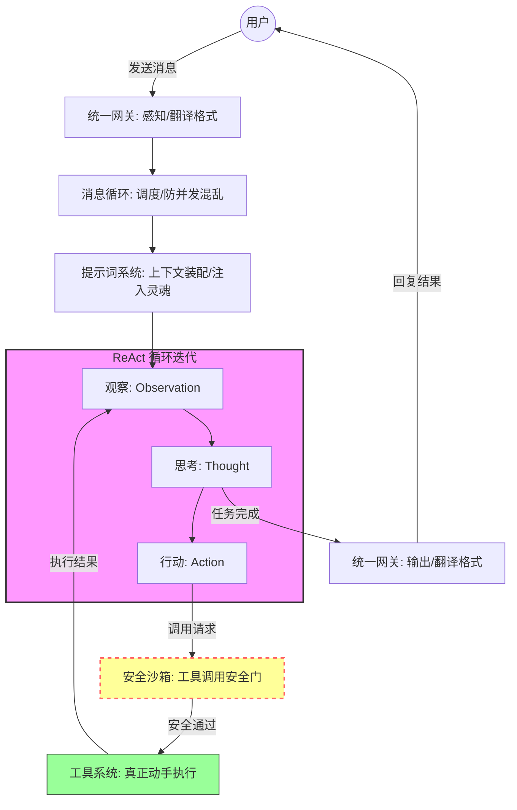

# Open Claw

[Hello-Claw](https://datawhalechina.github.io/hello-claw/)

Open claw成为了26年初最火热的项目，作为开发者肯定要第一时间来调研一下（虽然其实已经有些晚了）

## 安装

[HelloClaw的安装教程](https://datawhalechina.github.io/hello-claw/cn/adopt/chapter2/)

类似的教程还有很多，这里就不赘述了

值得一提的是，如果你使用的是Docker构建，且还是建立在WSL环境下，那么大概率会遇到部署上的问题，OpenClaw Gateway会一直重启，这是目前版本的小bug（2026-3），可以在OpenClaw的issue上找到相对应的解决方案，回答者也已经即时提交了PR，相信不久后就会得到修复

## OpenClaw究竟是什么

**OpenClaw是Agent**

这是对OpenClaw最好的诠释，即时OpenClaw核心基于Multi-Agent的思想进行开发，仍然逃脱不开Agent的定义

正如Google Agent白皮书上写的一样：

**宽泛地来说，生成式 AI Agent 可以被定义为一个应用程序， 通过观察周围世界并使用可用的工具来实现其目标**

不论是最近的OpenClaw还是当年的Manus，其本质都是Agent开发的爆火，只是Manus是一个闭源的，运行在云端上的，可定制化低的Agent，而OpenClaw这是一个开源的，可以运行在本地的，高定制化的Agent

这也进一步的说明了目前Agent开发的趋势————让Agent通过电脑来尽可能的完成人可以完成的操作

## OpenClaw的工具

**工具是将基础模型与外部世界连接起来的桥梁**

OpenClaw的强大能力就来源于各种各样的Tools，某种程度上，MCP，AgentSkills都属于广义上的Tools，但是我们一般会将编码在项目内部的Tools称之为Tools

OpenClaw的工具分为四个档次

|    配置档    |          能力范围          |        适用场景        |
| :-------: | :--------------------: | :----------------: |
|   full    |       无限制，所有工具可用       |   推荐——个人电脑上的全能助手   |
|  coding   | 文件读写、命令执行、会话管理、记忆、图片分析 |   开发者专用，不含消息和浏览器   |
| messaging |     消息收发、会话浏览、状态查看     | 纯聊天机器人，不能操作文件或执行命令 |
|  minimal  |         仅状态查看          |   最小权限，几乎什么都不能做    |

网上传的神乎其神的功能本质上就是启动了full权限，我们可以通过下列指令将其修改为full权限

```sh
# 查看当前配置
openclaw config get tools.profile

# 设置为 full（推荐）
openclaw config set tools.profile full
openclaw gateway restart
```

## OpenClaw的网关

OpenClaw的网关是OpenClaw运行的关键，如果我们使用Docker启动OpenClaw，不难发现启动的实际上就是一个OpenClaw的网关

OpenClaw的网关默认接受外界的信息（WebUI和聊天软件等），然后完成对LLM的调度

## LLM能力发展的过程

23年，OpenAI早期发布了FunctionCalling功能，为LLM提供了调用API的能力，在此之后，LLM就不仅限于为人们提供建议了，Agent也就由此而生

22年，普林斯顿大学与Google研究院一同发表了ReAct的论文，提出了推理和行动应该交织进行

- 传统方式: 先规划完所有步骤 → 按步骤执行（一次性，不能调整）
- ReAct方式: 观察 → 思考 → 行动 → 观察 → 思考 → 行动 ...（循环迭代）

此后的大模型便可以一次对话调用多个工具，进一步拓展了AI的实力


## AgentRuntime

AgentRutime是OpenClaw设计的核心之一，我们首先要理解什么是AgentRuntime

要理解AgentRuntime首先要理解Runtime是什么，Wiki中给出的解释是：“`运行时（Run time）`在计算机科学中**代表一个**计算机程序从开始执行到终止执行的运作、执行的**时期**

简单的讲，Runtime就是一个时期，这个时期包含了程序的开始到结束，具象化就表现为这个运行期所必须的所有东西（包含所有的代码和环境），这个东西将会贯穿整个程序运行的始终

所以我们不难发现，有些代码，如果想要将一个实例注册为全局任意时间可用，经常会将其给到一个叫XXXRuntime的东西，本质上也是这个含义（有些时候也会注册给一个叫XXXContext的东西，这个东西叫上下文，本身可以理解为Runtime的一部分）

回到AgentRuntime，我们不难理解，AgentRuntime就是Agent从开始到结束的运行时间，与直接与LLM对话的核心区别就在于维护了一个长期的状态，而根据Agent的定义，Agent是必须要有对外的Tool的，所以AgentRuntime自然也包含Tools，进而也就拥有了更多的能力

OpenClaw的创始人Peter Steinberger在原有基础上希望完成的是一个更加方便的Agent，可以通过简单的配置实现复杂的Agent功能

目前的OpenClaw可以实现编辑markdown就完成对于Agent的实现

## OpenClaw的核心设计

我们来看一下OpenClaw中包含的各个系统

- ReAct循环：使LLM在一次用户感知的对话中调用多个工具
- 提示词工程：给LLM赋予基础的身份
- 工具系统：各个Tools
- 消息循环：定时任务
- 统一网关：对外部的消息进行统一的接受和回应
- 安全沙箱：对系统提供一个基础的安全保护

### ReAct系统

:::info
在ReAct系统下，用户的一次对话会经过LLM的多次思考，然后调用不同的工具，即使工具发生错误了也不会报错，而是将错误信息当作反馈内容继续思考
:::

ReAct：ReasoningActing，即推理行动系统

ReAct论文本身指出，推理和行动本身不应该分开，应该xian'si'kao


### 提示词工程

OpenClaw的提示词工程基于八个文件

|      文件      |        一句话说明         |
| :----------: | :------------------: |
|   SOUL.md    | 定义"我是谁"——性格、价值观、行为准则 |
|   USER.md    |   定义"你是谁"——用户画像、偏好   |
|  AGENTS.md   | 定义"我怎么做事"——决策规则、工作流程 |
|   TOOLS.md   |   定义"我有什么资源"——环境配置   |
| IDENTITY.md  |      名字、头像等基础身份      |
|  MEMORY.md   |     长期记忆——事实、经验      |
| HEARTBEAT.md |        定时任务清单        |
| BOOTSTRAP.md |      首次运行的初始化引导      |

这些文件会在每一次对话时被注入到系统提示词中，Agent始终对于当前的环境有着清楚的认知，且这些信息是热更新的，OpenClaw的md文件发生变化，无需重启OpenClaw就能立刻感受到

### 工具系统

OpenClaw的内置工具只有四个：

- read：读取文件
- write：创建文件
- edit：修改文件
- exec：执行命令

正是这四个工具实现了OpenClaw的基础功能，并让OpenClaw可以通过Skills实现模块化拓展的能力

### 消息循环和事件驱动

OpenClaw针对每个用户的消息是阻塞的，也就是说，用户的每一条消息都是按顺序来处理的，这样可以保证OpenClaw的创建文件和读取文件的操作不会乱序

至于定时任务，OpenClaw则是使用HEARTBEAT.md实现，OpenClaw会监控HEARTBEAT.md文件，并根据里面写明的定时任务进行工作

### 统一网关

OpenClaw的网关采用的适配器模式，每个平台实现一个`ChannelPlugin`，所有外部平台的差异在网关层抹平，这样就可以实现通用的Agent

### 安全网关

OpenClaw的安全沙箱是基于多级的权限管理

|   层级   |  防御对象  |                      机制                       |
| :----: | :----: | :-------------------------------------------: |
| 文件系统沙箱 | 防止越权访问 |               Agent只能在指定工作目录内操作               |
| 命令执行沙箱 | 防止危险命令 | Security模式（deny/allowlist/full） + Ask模式（确认机制） |
| 网络访问沙箱 | 防止恶意外联 |                    白名单域名控制                    |

以`exec`工具为例，它有三层安全模型：

1. **Security模式**决定基本权限——deny（全部禁止）、allowlist（白名单）、full（全部允许）
2. **Ask模式**决定何时需要人工确认——off（从不）、on-miss（不在白名单时）、always（每次都问）
3. **安全命令列表（safeBins）** 提供只读工具的便捷通道——`jq`、`head`、`tail`等安全命令可以直接执行

### 执行

基于上面的系统，OpenClaw的一次用户对话就转变为:



